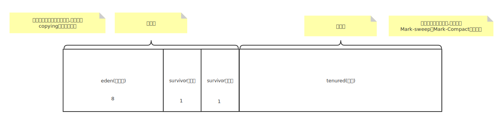

# 一、入门

## 一、Java文件是如何被解释执行?

### 一、解析


> 1. java文件首先被编译成字节码文件
> 2. 编译之后被classloader装载到内存中,其中也包括Java类库。
> 3. 被解释执行或者执行二进制文件

### 二、概念

> 1. Java是解释编译混合性语言。
> 2. JIT及时编译:Java中当某一段代码或者某个方法频繁的被调用,JVM就会直接编译成二进制本地文件,后续再次调用,由JIT及时编译器执行。
> 3. 字节码解释器:就是我们所说的解释执行,效率比JIT及时编译解释器效率低。

### 三、手动改变Java执行模式

> -Xmixed 默认混合模式:JVM默认执行模式。
>
> -Xint 解释执行:启动速度比混合模式,编译执行模式快,执行稍慢。
>
> -Xcomp 编译执行: 启动速度慢,需要加载所需的全部类库。但是执行效率比两者高。


## 二、基于JVM的语言汇总

### 一、解析


> 1. JVM只是一种规范而已,与语言无关。
> 2. 只要能编译成class(字节码)文件的语言都可以被JVM执行,所以说JVM只跟class文件有关系,与Java无关。

## 三、JDK结构

### 一、解析


> 1. JDK:包含jre与Java类库跟一些Java开发工具
> 2. JRE:主要包含JVM虚拟机以及JVM执行所需的核心类库。
> 3. JVM:主要用来执行代码。

# 二、Class文件解析

## 一、插件列表

> 1. Binary/hexadecimal editor:用于查看字节码文件。
> 2. Jclasslib bytecode viewer:用于查看常量池,以及操作数栈。

## 一、字节码文件示例

> 字节码文件以十六进制的格式打开是这样的。

```bash
cafe babe 0000 0034 0010 0a0o 0300 0doz
000e 0700 0f01 0006 3c69 6e69 743e 0100
0328 2956 0100 0443 6f64 6501 0001 4c69
6e65 4e75 6d62 6572 5461 1163 2665 8845
4c6f 6361 6c56 6172 6961 626c 6554 6162
6c65 0100 0474 6869 7301 002d 4c63 6f6d
2f6d 6173 6869 6269 6e67 2f6a 766d 2f62
7974 6563 6464 652f 15430 3130 305 4279
7465 4367 6465 3031 3601 000a 5366 7572
6365 4669 6c65 0100 1554 3031 3030 5f42
7974 6543 6f64 6530 312e 6a61 7661 0c00
0400 0501 002b 636f 6d2f 6d61 7368 6962
696e 672f 6a76 6d2f 6279 7465 636f 6465
2£54 3031 3030 5542 7974 6543 6£64 6530
3101 0010 6261 7661 2f6c 616e 672f 4f62
6a65 6374 0021 0002 0003 0000 0000 0001
0001 0004 0005 0001 2006 9000 0022 0001
```

# 三、类加载

## 一、类加载流程

> 流程图


> 1. 符号引用:
>
>    ```java
>    #34 = Utf8               java/lang/Object
>    //将 java/lang/Object这个字符串转化为内存中的直接引用。
>    ```
>
> 2. 静态变量赋初始值:
>
>    ```java
>    public class Demo {
>        public static void main(String[] args)  {
>            System.out.println(Demo02.num); //6
>        }
>                                     
>        static class Demo02 {
>            public static int num = 5;
>            public static Demo02 demo02 = new Demo02();
>                                     
>            private Demo02() {
>                num += 1;
>            }
>        }
>    }
>                                     
>    ```
>
>    

## 二、类创建(new)


## 三、反射

### 一、详解

> 当类加载到内存中其实还生成了class对象(大class),class对象包含了对二进制文件的解析。反射就是调用class对象中的方法来得到class文件解析过后的数据

> 大class只会加载一次,之后双亲委派机制详细讲解。


### 二、代码展示

```java
//使用当前的classLoader来加载Test.class文件
//加载完成之后,返回大Class对象
Class<?> aClass = Demo.class.getClassLoader().loadClass("com.qianqiwei.Test");
Object o = aClass.getConstructor().newInstance();
Method[] declaredMethods = aClass.getDeclaredMethods();
for (Method method:declaredMethods){
    method.invoke(o);
}
```


## 四、双亲委派

### 一、ClassLoader详解


### 二、类加载过程

> classLoader缓存:当类load到内存中时,首先会被类加载器加载,类加载器并不是直接去加载class文件,而是从自己的缓存区中查看是否已经缓存了,如果当前class文件没有被load到缓存中,就会让父加载器去缓存中加载,以此类推。
>
> classLoader加载:如果顶层加载器也加载不了,就会在自己加载范围内加载类,如果还加载不了就会交给子加载器加载,以此类推,直到最底层加载器。当加载器加载成功之后就会load到自己的缓存中,否则就会交给子加载器,如果最底层加载还加载不了,报classNotFound。
>
> classLoader加载次数:一个class文件只会被classLoader加载一次,下次加载直接从缓存区中拿。


### 三、源码解析

**Classloader**

```java
protected Class<?> loadClass(String name, boolean resolve)
        throws ClassNotFoundException
    {
        synchronized (getClassLoadingLock(name)) {
            // 第一步:从当前类加载器缓存中查看当前类是否已经被加载了
            Class<?> c = findLoadedClass(name);
            //如果在缓存区找到了,直接返回
            if (c == null) {
                long t0 = System.nanoTime();
                try {
                  //如果不是顶层加载器,就让父加载器加载当前类。
                    if (parent != null) {
                       //调用父加载器的loadClass方法(类似于递归)
                        c = parent.loadClass(name, false);
                    } else {
                         //由于bootstrap类加载器在java中没有具体引用
                        //当parent为null的时候就去调用bootstrap类加载器
                        c = findBootstrapClassOrNull(name);
                    }
                } catch (ClassNotFoundException e) {
                    // ClassNotFoundException thrown if class not found
                    // from the non-null parent class loader
                }

              //如果以上加载器都加载不了,只能由我来进行加载
              //从ExtensionClassloader开始查找
                if (c == null) {
                    long t1 = System.nanoTime();
                    //交给当前类加载器从自己加载范围中加载。如果加载不了交给子加载器去加载.
                    //自定义类加载只需要重写这个方法。
                    c = findClass(name);
                    // this is the defining class loader; record the stats
                    PerfCounter.getParentDelegationTime().addTime(t1 - t0);
                    PerfCounter.getFindClassTime().addElapsedTimeFrom(t1);
                    PerfCounter.getFindClasses().increment();
                }
            }
            if (resolve) {
                resolveClass(c);
            }
            //返回查找的对象
            return c;
        }
    }
```

```java
//这里用到了模版模式,交给类加载器自己实现。
protected Class<?> findClass(String name) throws ClassNotFoundException {
    throw new ClassNotFoundException(name);
}
```

> 1. 打破双亲委派机制:重写loadClass方法即可。(热部署)
> 2. 自定义classLoader:实现ClassLoader类,重写findClass方法

### 四、总结

#### 一、为什么要用双亲委派?

> 主要为了安全。


## 四、常量池


### 一、静态常量池

#### 一、由来

> 静态常量池又称文件常量池, 每个Java文件编译成class文件,class文件就包含静态常量池。

#### 二、包含内容

> 1. 符号引用: 类的全限定名称。
>
> 2. 字面量:
>
>    > 1. 字符型:说白了就是字符串
>    > 2. 数值型:就是数字。

### 二、运行时常量池与字符串常量池

#### 一、由来

> 当class文件加载到内存的时候,就会对class文件进行解析(resolution),解析的过程中就会将静态常量池转化为运行时常量池以及字符串常量池。

#### 二、运行时常量池

> 运行时常量池一般存储的是直接引用,以及字面量(数值型),运行时常量池存储在方法区中。

#### 三、字符串常量池

> 主要存储字符类型的数据,字符串常量池存储在堆中。

# 四、Java内存模型(JMM)

## 一、存储器层次结构


> 1. cpu内部处理数据最快的部分是寄存器。其次是一缓,二缓。例如三缓,内存,储存器(磁盘)等与cpu共享。
> 2. cpu要对硬盘中的数据进行处理,数据会被load到内存中,cpu就会查找最近的缓存中是否有当前数据,如果有直接处理,如果没有一直往下找(一缓-->二缓-->三缓-->内存)
> 3. cpu找到要被处理的数据的时候,就会load到最近的缓存中(内存---load---->三级缓存),然后交给cpu进行处理。

## 二、总线锁+缓存锁


> 1. 一般老式的cpu都是上总线锁来保证数据的一致性,然而这种效率太慢,就有了总线锁+缓存锁的解决方案。

## 三、伪共享问题

### 一、缓存行

> CPU读取数据不是一个数据一个数据读取的,而是通过缓存行进行读取缓存行进行读取。
>
> 缓存大小:64字节(512位)的数组

### 一、为什么是会产生伪共享?

> 1. 概念:当两个cpu内部缓存读取不同值,恰巧两个值在同一缓存行之内,就会产生伪共享。
> 2. 详解:当一个cpu更改了一个值A并且A在M缓存行里,就会通知其他cpu缓存去更行(重新读取)这块缓存行。当其他cpu缓存的值B也在M缓存行里,就会更新M缓存行,但是当前CPU并不需要更改这个值,就会造成不必要的开销。
> 3. 总结:位于同一缓存行的两个数据,被不同的cpu锁定,产生互相影响为共享问题。


## 四、伪共享解决方案

> 伪共享会造成效率变慢的问题。

### 一、缓存行对齐

> Java中可以使用Long(64位)类型来进行缓存行填充,虽然占用了内存,但是执行效率有所提升。
>
> 典型用例:disruptor

## 五、指令重排

### 一、详解


### 二、CPU内存屏障

> 1. sfrench (save): 在sfrench指令前的写操作必须在sfrench指令后的写操作之前完成。
> 2. Ifrench(load): 在Ifrench指令前的读操作必须在Ifrench指令后的读操作之前完成。
> 3. mfrench: 在mfrench指令前的读写操作必须在mfrench指令后的读写操作之前完成。

### 三、JVM规范

> 1. loadload屏障: 对应这样一条语句 load1; loadload; load2 在load2读读取操作要读取的数据之前,要保证load1要读取的数据读取完成 。
> 2. storestore屏障: 对应这样一条语句 store1; storestore; store2 在store2写入数据之前,要保证store1写入操作对其他CPU可见。
> 3. loadStore屏障:对应这样一条语句 load1; loadStore; store2 在store2写入之前,要保证load1读取数据读取完成。
> 4. storeLoad屏障: 对应这样一条语句 store1; loadStore; load2 在load2读取数据之前,要保证store1写入对所有处理器可见。

###  四、Java8大原子操作(已弃用)

> lock：主内存,标识变量为线程独占
> unlock：主内存，解锁线程独占变量
> read: 主内存，读取内容到工作内存
> load:工作内存，read后的值放入线程本地变量副本
> use:工作内存,传值给执行引擎
> assign:工作内存,执行引擎结果赋值给线程本地变量
> store:工作内存,存值到主内存给write备用
> write:主内存,写变量值

### 五、volatile

> 在内存读写都加屏障。


## 六、对象内存布局

### 一、查看虚拟机配置

#### 一、命令

```bash
java -XX:+PrintCommandLineFlags -version
```

#### 二、参数详解

```bash
-XX:G1ConcRefinementThreads=8
-XX:GCDrainStackTargetSize=64
-XX:InitialHeapSize=268435456  #初始化堆内存大小
-XX:MaxHeapSize=4294967296     #最大堆内存大小
-XX:+PrintCommandLineFlags
-XX:ReservedCodeCacheSize=251658240 
-XX:+SegmentedCodeCache
-XX:+UseCompressedClassPointers  #对象头
-XX:+UseCompressedOops  #对象内存布局
-XX:+UseG1GC 
openjdk version "11.0.16" 2022-07-19 LTS
OpenJDK Runtime Environment Zulu11.58+15-CA (build 11.0.16+8-LTS)
OpenJDK 64-Bit Server VM Zulu11.58+15-CA (build 11.0.16+8-LTS, mixed mode)
```

### 二、对象内存布局


> 数组对象比普通对象多了个长度占4个字节。

### 三、对象大小

> 结论:
>
> 1. 对象大小:16字节
> 2. 数组对象大小:16个字节
> 3. 分情况。

> 1. 对象头占8个字节
> 2. ClassPointers默认**开启压缩**占4个字节
> 3. 实例数据没有占0个字节
> 4. padding对齐占4个字节(填充至8的倍数)。

# 五、JVM内存结构

## 一、简介


### 一、ProgramCounter(程序计数器)

> 指令存放区域

> Java运行的时候去执行一条一条指令,其中指令就存放在程序计数器里。
>
> 对于线程来说程序计数器也是私有的。

> 为什么程序计数器是私有的:cpu不断切换线程,程序计数器就是记录当前线程执行到哪条指令了。

### 二、JVMStacks(JVM栈)

> 每一个线程对应一个栈。对于线程来说他是私有的。

### 三、Native method stacks(本地方法栈)

> 是由c,c++来实现的。对于线程来说他是私有的。

### 四、Direct memory(直接内存)

> JVM虚拟机内部可以访问操作系统的内存,多用于NIO

### 五、Method Area(方法区)

> 线程之间共享。

> Perm Space:JDK1.8之前一般叫方法区为永久区。
>
> Meta Space:JDK 1.8以后方法区叫做元数据区。

> 存什么?:字符串常量池,运行时常量池等。

> 字符串常量池随着方法区的改变,从以前存储到方法区(JDK1.8之前),到现在存储到堆中(JDK1.8之后)。

### 六、Heap(堆)

>  线程之间共享。详细之后再写

### 七、总结


## 二、JVM Stacks


### 一、Frame

> 在当前线程中每一个方法对应着一个栈帧。

### 二、local variables Table

> 局部变量表:指的是栈帧中的局部变量形成的变量表。

### 三、Operand Stacks

> 操作数栈:每一个栈桢包含自己的操作数栈。具体看Java指令。
>
> 操作数栈会保存局部变量值,以及引用指针(堆内存中的对象)
>
> 压栈:对变量进行操作的过程。 
>
> 弹栈:变量赋值的过程。

### 四、dynamic linking

> 指向运行时常量池中的直接引用。

# 六、GC

## 一、GC定位垃圾常用的算法

> 没有引用指向的对象都是垃圾

### 一、引用计数(Java不用)

#### 一、用例


#### 二、缺点


### 二、根可达算法

#### 一、根对象

> 1. main方法对应栈帧中局部变量引用的对象,这些对象叫做根对象。
> 2. 静态变量所引用的对象。
> 3. 常量池里所引用的对象。

## 二、GC清除垃圾算法

### 一、Mark-sweep(标记清除)


> 只对标记的垃圾进行处理。

#### 一、优点

> 存活对象比较多的情况下效率比较高。

#### 二、缺点

> 1. 会进行两边扫描,效率偏低一点。
>    1. 根据根可达算法找出存活的对象。
>    2. 根据根可达算法找出没用的对象进行清理。
> 2. 容易产生碎片。


### 二、Coping(拷贝)


> 对标记的垃圾进行处理并整理。

#### 一、优点

> 1. 对象存活数量较少的情况下效率较高。
> 2. 只会扫描一次。
> 3. 会对清除的对象进行整理,没有碎片。
> 4. 适合新生代。

#### 二、缺点

> 1. 需要移动复制对象,调整引用。


### 三、Mark-Compact(标记压缩)


> 对标记的垃圾进行清除,并整理。

#### 一、优点

> 1. 不会产生内存减半。
> 2. 不会产生碎片。
> 3. 方便对象分配。

#### 二、缺点

> 1. 需要扫描两次。
> 2. 需要移动对象。调整引用。


## 三、堆内存逻辑分区

### 一、布局



### 二、伊甸区与幸存区


### 三、YGC与FullGC


### 四、对象何时进入老年代

> 参数:  XX:MaxTenuringThreshold

### 五、参数设置

> -Xmn<大小>:为年轻代(新生代)设置初始和最大堆大小(以字节为单位)
>
> -Xms<大小>:设置初始 Java 堆大小
>
>  -Xmx<大小>:设置最大 Java 堆大小

## 四、常见的垃圾回收器


