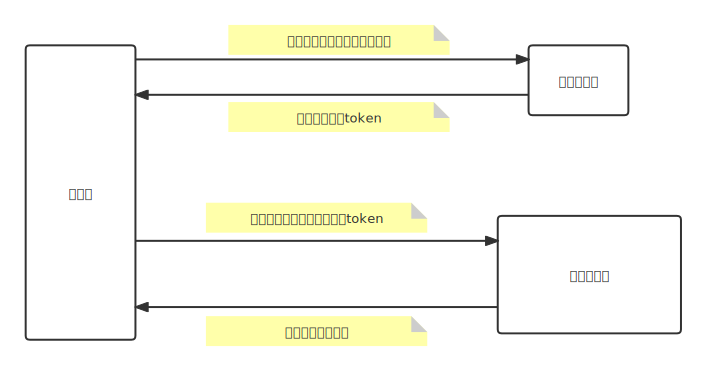
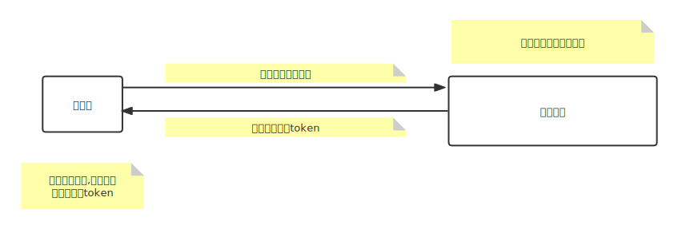
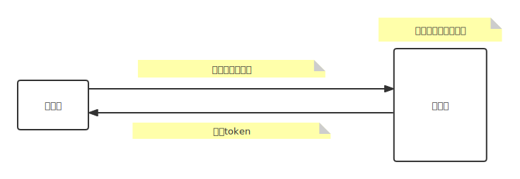

# 一、4种授权模式概述

## 1、授权码模式

## 2、密码模式

> 客户端携带用户名与密码从认证服务器授权得到token

## 3、客户端模式

> 没有用户参与的,完全信任的服务器端服务

# 二、三方登录用例

## 一、基本流程图

## 二、支付宝登陆

### 一、官方文档

> 1. 第三方支付宝登录:[网站如何实现第三方支付宝登录 - 支付宝文档中心 (alipay.com)](https://opendocs.alipay.com/support/01rg6a)
> 2. token获取以及用户信息获取API:[换取授权访问令牌接口 - 支付宝文档中心 (alipay.com)](https://opendocs.alipay.com/open/02ailc)

### 二、准备工作

> 1. 自行去官网创建网站应用
> 2. 配置详情:[接入准备 - 支付宝文档中心 (alipay.com)](https://opendocs.alipay.com/open/218/105326?ref=api)

### 三、流程

