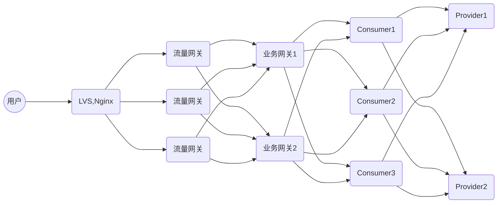

## 一、Hystrix

#### 1、Hystrix概念

1.1、Hystrix降级:

> 当Consumer将请求打到provider时,provider出错,或者链接超时,就会进行降级。
>
> Hystrix:相当于try catch

1.2、Hystrix限流:

> 当Consumer将请求打到provider时,provider执行线程数满了,就会启用拒绝策略,Hystrix进行线程降级。
>
> Hystrix: 当请求的个数超过Hystrix线程数与任务队列的最大值,Hystrix就会直接走降级,直到线程池线程执行完成。

1.3、Hystrix隔离:

> 当请求通过Tomcat的时候,Tomcat分配线程给这个请求,此请求进入Hystrix线程池,Hystrix线程池分配线程给此请求。

1.4、Hystrix熔断:

> 当Consumer将请求打到provider时,计数,如果连续失败次数达到阈值的时候,进行熔断,当请求再次打过来的时候直接走降级,但是可以给定条件让Consumer尝试链接。万一成功。
>
> Hystrix: Hystrix内部默认20次调用失败,启动断路机制,5秒之后恢复访问,在5秒之内接受到的请求直接走降级处理。 

#### 2、设置服务器线程池(Tomcat)

```yaml
server:
  port: 8080
  tomcat:
    #设置等待队列
    accept-count: 0
    #设值最大并发链接数
    max-connections: 10000
    threads:
      #设置线程池最小线程数
      min-spare: 1
      #设置线程池最大线程数 超出线程最大执行数,就会进入等待队列。如果等待队列值满了,tomcat就会执行拒绝策略。
      max: 3
```

#### 3、Hystrix操作普通用例(脱离SpringCloud):

```java
public class HystrixTest extends HystrixCommand<String> {
    
    protected HystrixTest(HystrixCommandGroupKey group) {
        super(group);
    }

    protected HystrixTest(HystrixCommandGroupKey group, HystrixThreadPoolKey threadPool) {
        super(group, threadPool);
    }

    protected HystrixTest(HystrixCommandGroupKey group, int executionIsolationThreadTimeoutInMilliseconds) {
        super(group, executionIsolationThreadTimeoutInMilliseconds);
    }

    protected HystrixTest(HystrixCommandGroupKey group, HystrixThreadPoolKey threadPool, int executionIsolationThreadTimeoutInMilliseconds) {
        super(group, threadPool, executionIsolationThreadTimeoutInMilliseconds);
    }

    protected HystrixTest(Setter setter) {
        super(setter);
    }

    //这里相当于进行try操作
    @Override
    protected String run() throws Exception {
        int i = 1 / 1;
        return "任务执行结束";
    }

    //这里进行catch操作,备用逻辑
    @Override
    protected String getFallback() {
        return "任务执行失败";
    }

    public static void main(String[] args) {
        //异步执行
        Future hystrixTest = new HystrixTest(HystrixCommandGroupKey.Factory.asKey("你好")).queue();
        try {
            Object o = hystrixTest.get();
            System.out.println(o);
        } catch (InterruptedException e) {
            e.printStackTrace();
        } catch (ExecutionException e) {
            e.printStackTrace();
        }

        //同步执行
        HystrixTest hystrixTest1 = new HystrixTest(HystrixCommandGroupKey.Factory.asKey("你哈"));
        String execute = hystrixTest1.execute();
        System.out.println(execute);

    }

}
```

#### 4、fegin与hystrix整合:

> fallback:所有的请求共用一个线程池。

4.1、配置:fegin遇到请求失败交给Hystrix做处理。

```yaml
feign:
  hystrix:
    enabled: true
```

4.2、配置FeginClient:fallback

```java
@FeignClient(value = "Provider",fallback = HystrixTest.class)
public interface WebService {
    @GetMapping("/index")
    public String index();
    @GetMapping("/getPort")
    public String getPort();
    @GetMapping("/getValue")
    public String getValue(@RequestParam("value")String value);
}
```

4.3、配置Hystrix

```java
//交给Spring来管理,并且实现fegin接口
@Component
public class HystrixTest implements WebService {
    //这里只要遇到报错就会返回异常。
    public String index() {
        return "index:降级了";
    }

    public String getPort() {
        return "getPort:降级了";
    }

    public String getValue(@RequestParam("value") String value) {
        return "value:降级了";
    }

}
```

#### 5、hystrix与fallbackFactory整合:

> fallbackFactory所有的请求共用的一个线程池

5.1、配置Hystrix短路机制:

> Hystrix如果失败10次就会进行熔断,5秒之后再去试试(Hystrix内部实现)

```yaml
hystrix:
  command:
    default:
      circuitBreaker:
        #设置Hystrix超过多少次错误发生短路
        requestVolumeThreshold: 3
      execution:
        isolation:
          thread:
            #设置Hystrix任务返回最大超时时间
            timeoutInMilliseconds: 2000


feign:
  client:
    config:
      default:
        #设置ribbon超时时间(必须大于Hystrix任务返回最大超时时间)
        readTimeout: 5000
  hystrix:
    enabled: true

```

5.2、配置fallbackFactory(熔断,降级):

```java
@Component
//实现FallbackFactory方法
public class HystrixTest implements FallbackFactory<WebService> {
    ExceptionHandler exceptionHandler = new ExceptionHandler();
    //在这里进行操作
    @Override
    public WebService create(Throwable throwable) {
        //远程服务调用出错走这一步。
        return new WebService() {
            @Override
            public String index() {
                return exceptionHandler.handle(throwable);
            }

            @Override
            public String getPort() {
                return exceptionHandler.handle(throwable);
            }

            @Override
            public String getValue(String value) {
                return exceptionHandler.handle(throwable);
            }
        };
    }

    static class ExceptionHandler {
        AtomicInteger atomicInteger = new AtomicInteger();
        public String handle(Throwable throwable) {
            System.out.println(throwable);
            //进行错误判断。
            if (throwable instanceof FeignException.InternalServerError) {
                System.out.println(throwable.getMessage());
                return "服务器内部错误"+"错误"+atomicInteger.incrementAndGet()+"次";
            }
            else if (throwable instanceof RuntimeException) {
                return "Consumer内部异常";
            }else if (throwable instanceof HystrixTimeoutException) {
                return "链接超时,错误"+atomicInteger.incrementAndGet()+"次";
            }
            return "未知错误";
        }

    }
}
```

#### 6、配置Hystrix线程隔离与限流

```yaml
hystrix:
  threadpool:
    default:
      #设置核心线程数
      coreSize: 3
      #设置最大线程数
      maximumSize: 3
      #使用同步队列
      maxQueueSize: -1
      #除核心线程数外线程存活时间
      keepAliveTimeMinutes: 1000
      #允许最大线程数生效
      allowMaximumSizeToDivergeFromCoreSize: true

  command:
    default:
      circuitBreaker:
        #设置Hystrix超过多少次错误发生短路
        requestVolumeThreshold: 100

      execution:
        isolation:
          thread:
            #设置Hystrix任务返回最大超时时间
            timeoutInMilliseconds: 1000000


feign:
  client:
    config:
      default:
        #设置ribbon超时时间(ribbon业务超时有重试机制,这里暂且不管)
        readTimeout: 1000000
  hystrix:
    enabled: true
```

6.1、对异常进行捕捉:

```java
@Component
//实现FallbackFactory方法
public class HystrixTest implements FallbackFactory<WebService> {
    ExceptionHandler exceptionHandler = new ExceptionHandler();
    //在这里进行操作
    @Override
    public WebService create(Throwable throwable) {
        return new WebService() {
            @Override
            public String index() {
                return exceptionHandler.handle(throwable);
            }

            @Override
            public String getPort() {
                return exceptionHandler.handle(throwable);
            }

            @Override
            public String getValue(String value) {
                return exceptionHandler.handle(throwable);
            }
        };
    }

    static class ExceptionHandler {
        AtomicInteger atomicInteger = new AtomicInteger();
        public String handle(Throwable throwable) {
            System.out.println(throwable);
            if (throwable instanceof RejectedExecutionException){
                return "访问量过高";
            }
            else if (throwable instanceof FeignException.InternalServerError) {
                System.out.println(throwable.getMessage());
                return "服务器内部错误"+"错误"+atomicInteger.incrementAndGet()+"次";
            }
            else if (throwable instanceof RuntimeException) {
                return "Consumer内部异常";
            }else if (throwable instanceof HystrixTimeoutException) {
                return "链接超时,错误"+atomicInteger.incrementAndGet()+"次";
            }
            return "未知错误";
        }

    }
}
```

6.2、测试用例(为了占用线程池线程,方便测试)

```java
@GetMapping("/index")
public String index() {
    System.out.println("Provider02来了");
    try {
        TimeUnit.SECONDS.sleep(1000);
    } catch (InterruptedException e) {
        e.printStackTrace();
    }
    return "Provider2:index";
}
```

#### 7、dashboard(Hystrix控制面板)

7.1、导入依赖:

```xml
<!-- https://mvnrepository.com/artifact/org.springframework.cloud/spring-cloud-starter-netflix-hystrix-dashboard -->
<dependency>
    <groupId>org.springframework.cloud</groupId>
    <artifactId>spring-cloud-starter-netflix-hystrix-dashboard</artifactId>
    <version>2.2.10.RELEASE</version>
</dependency>
```

7.2、yaml配置:

```yaml
dashboard:
  proxy-stream-allow-list: www.eurekaclient01.com
```

7.2、开启注解:

```java
@EnableHystrixDashboard
public class ConsumerApplication {

    public static void main(String[] args) {
        SpringApplication.run(ConsumerApplication.class, args);
    }

}
```

#### 8、限流策略

> 1. 线程池限流:当某个方法进行限流之后,业务线程打到这个方法之后,hystrix会从线程池开辟一个新的线程来处理业务,当线程池满了之后,就会走拒绝策略(降级)。


## 二、Zuul网关

#### 1、前置

> 业务网关理解：
>
> 1. LVS,Nginx:作为负载均衡服务器,穿透模式效率很高(不需要进行业务处理)
> 2. 流量网关:做防火墙,例如防止爬虫。
> 3. 业务网关:主要进行业务处理,用户权限校验等。
> 4. 路由:根据URI定位到资源服务器



#### 2、Zuul Yaml简单配置

```yaml
zuul:
  #进行路由
  routes:
    qianqiwei:
      #路径
      path: /qianqiwei/**
      #路径对应的服务名
      service-id: consumer
  #路径前面加上前缀
  prefix: /test/v1/
```

## 三、链路追踪：

#### 1、为每一个需要检测的节点导入依赖:

```xml
<!-- https://mvnrepository.com/artifact/org.springframework.cloud/spring-cloud-starter-sleuth -->
<dependency>
    <groupId>org.springframework.cloud</groupId>
    <artifactId>spring-cloud-starter-sleuth</artifactId>
    <version>2.2.8.RELEASE</version>
</dependency>
```

#### 2、引入zipkin(为每一个需要检测的节点导入):

```xml
<!-- https://mvnrepository.com/artifact/org.springframework.cloud/spring-cloud-starter-zipkin -->
<dependency>
    <groupId>org.springframework.cloud</groupId>
    <artifactId>spring-cloud-starter-zipkin</artifactId>
    <version>2.2.8.RELEASE</version>
</dependency>

```

#### 3、配置zipkin:

```yaml
spring:
    #配置zipkin
  zipkin:
    #向zipkin注册
    base-url: http://localhost:9411/
    #对链路进行操作
  sleuth:
    #多久更新一次信息
    sampler:
      rate: 1
```

## 四、SpringCloudGateWay

#### 一、前置

1、性能

> 1. zuul 1.x : 底层采用了纯servlet,现在已经非常成熟。
> 2. zuul 2.x : 底层采用了netty性能对比1.x性能略有提升,但提升不大,逐渐闭源。
> 3. SpringCloudGateWay : 性能比Zuul高,功能相对于zuul也有很多。 

2、基础

> 1. **路由**：网关的基本构建基块。它由 ID、目标 URI、断言和筛选器集合定义。如果断言为 true，则匹配路由。

#### 二、配置

##### 一、配置

```yaml
spring:
  cloud:
    gateway:
      routes:
          #给定id(谁便给)
        - id: qianqiwei
          #给定要代理的路由
          uri: http://www.EurekaClient01.com:8081
          #断言(一下所有的要求都匹配,包括Filters,才会中转到代理路由)
          predicates:
            #给定要代理的路由路径匹配(如果匹配成功追加到uri路径后面)
            - Path=/**
            #给定只接受什么类型的请求
            - Method=get
            #指定打过来请求主机名
            - Host=www.xxxx.com
            #指定给什么参数名,以及匹配规则
            - Query=[参数名称],[正则匹配]
            #指定Cookie,例子(name=qianqiwei; 数值)
            - Cookie=key,value
            #指定请求头参数
            - Header=[参数],[正则]
          filters:
            #删除几层路径
            - StripPrefix=0

server:
  port: 8084
```

1.1、测试：

```apl
GET http://localhost:8084/index
Accept: application/json
Host: www.qianqiwei.com
cookie: name=qianqiwei;こんにちわ
```

##### 二、约定大于配置

> SpringCloudGateWay自动配置

```yaml
spring:
  application:
    name: gateway
  cloud:
    nacos:
      server-addr: 192.168.1.6:8848
      username: nacos
      password: nacos
    gateway:
      discovery:
        locator:
          enabled: true
          lower-case-service-id: true
```

> 访问路径:http://[主机]:[端口号]/[服务名称]/**


##### 三、整合Eureka

```yaml
spring:
  cloud:
    gateway:
      discovery:
        locator:
          #从服务拉去列表
          enabled: true
      #配置动态路由
      routes:
        - id: qianqiwei
          #ribbon做负载均衡
          uri: lb://consumer
          #自定义路径
          predicates:
            - Path=/qianqiwei/**
          filters:
            - StripPrefix=1

eureka:
  client:
    register-with-eureka: true
    fetch-registry: true
    registry-fetch-interval-seconds: 1
    service-url:
      defaultZone: http://www.EurekaServer01.com:8080/eureka/
  instance:
    hostname: www.EurekaClient04.com
server:
  port: 8084
```

2.1、自定义网关负载均衡策略:

```yaml
#自定义ribbon负载均衡策略
ribbon:
  #哪个类作为负载均衡
  NFLoadBalancerRuleClassName: com.qianqiwei.springcloudgateway.utils.MyRule.java
```

```java
//自定义负载均衡策略
@Component
public class MyRule extends AbstractLoadBalancerRule {
    @Override
    public void initWithNiwsConfig(IClientConfig iClientConfig) {

    }

    @Override
    public Server choose(Object o) {
        List<Server> servers = this.getLoadBalancer().getReachableServers();
        //随机做负载均衡
        System.out.println(servers);
        int random_num=new Random().nextInt(servers.size());
        return servers.get(random_num);
    }
}
```

2.2、自定义路由:

```java
@Configuration
public class GateWayConfig {
    //自定义路由
    @Bean
    public RouteLocator customRouteLocator(RouteLocatorBuilder routeLocatorBuilder) {
        System.out.println("我进来了");
        RouteLocatorBuilder.Builder routes = routeLocatorBuilder.routes();
        routes.route(route ->
                route.path("/qianqiwei/**")
                        .filters(filter -> filter.stripPrefix(1))
                        .uri("lb://consumer")
        );
        return routes.build();
    }
}
```

2.3、自定义网关过滤器:

```java
@Component
public class MyFilter implements Ordered, GlobalFilter {
    //拦截过滤请求
    @Override
    public Mono<Void> filter(ServerWebExchange exchange, GatewayFilterChain chain) {
       ServerHttpRequest request = exchange.getRequest();
        List<String> list = request.getQueryParams().get("name");
        if (list != null) {
            String s = list.get(0);
            System.out.println(s);
            return chain.filter(exchange);
        }
         System.out.println("过滤器未通过");
        //条件不通过,不放行。
        //设置相应
        ServerHttpResponse response = exchange.getResponse();
        //返回响应状态
        response.setStatusCode(HttpStatus.UNAUTHORIZED);
        Mono<Void> NoAuthorized = response.setComplete();
        return NoAuthorized;
    }
    //设置过滤器的权重
    //order越大,
    @Override
    public int getOrder() {
        return 100;
    }
}
```

##### 四、灰度发布:

1、前置:

> 设置每台服务器不同的权重。

```yaml
spring:
  cloud:
    gateway:
      discovery:
        locator:
          #从服务拉去列表
          enabled: true
      routes:
        - id: v1
          #指的是有70%的几率会调起这台服务器
          uri: http://www.EurekaClient02.com:8082/
          predicates:
            - Path=/v1/qianqiwei/**
              #分配权重
            - Weight=service,70
          filters:
            - StripPrefix=2
        - id: v2
          #指的是有30%的几率会调起这台服务器
          uri: http://www.EurekaClient03.com:8083/
          predicates:
            - Path=/v1/qianqiwei/**
                #分配权重
            - Weight=service,30
          filters:
            - StripPrefix=2
```

##### 五、令牌桶算法

> 对用户请求(网关)进行限流,指定用户访问次数,超过访问次数,再次访问,取决于令牌发放速度。

4.1、yaml配置：

```yaml
spring:
  cloud:
    gateway:
      discovery:
        locator:
          #从服务拉去列表
          enabled: true
      routes:
        - id: qianqiwei
          uri: lb://consumer
          predicates:
            - Path=/qianqiwei/**
          filters:
            - StripPrefix=1
            - name: RequestRateLimiter #固定写法
              args:
                key-resolver: "#{@userKeyResolver}"  #容spring容器里拿取bean,标记用户。
                redis-rate-limiter.replenishRate: 1  #令牌桶每秒填充平均速率
                redis-rate-limiter.burstCapacity: 3  #令牌桶总容量
```

4.2、容器配置:

```java
//容器配置
@Bean
KeyResolver userKeyResolver(){
    return exchange -> Mono.just(exchange.getRequest().getQueryParams().getFirst("user")); //通过什么方式来记录用户
}
```

4.3、redis操作

```java
1) "request_rate_limiter.{12}.timestamp" //存活时间为10s
2) "request_rate_limiter.{12}.tokens"   //存活时间为10s,存储令牌剩余个数
```

备注: 

> 如果超出规定次数,就会报426错误。


