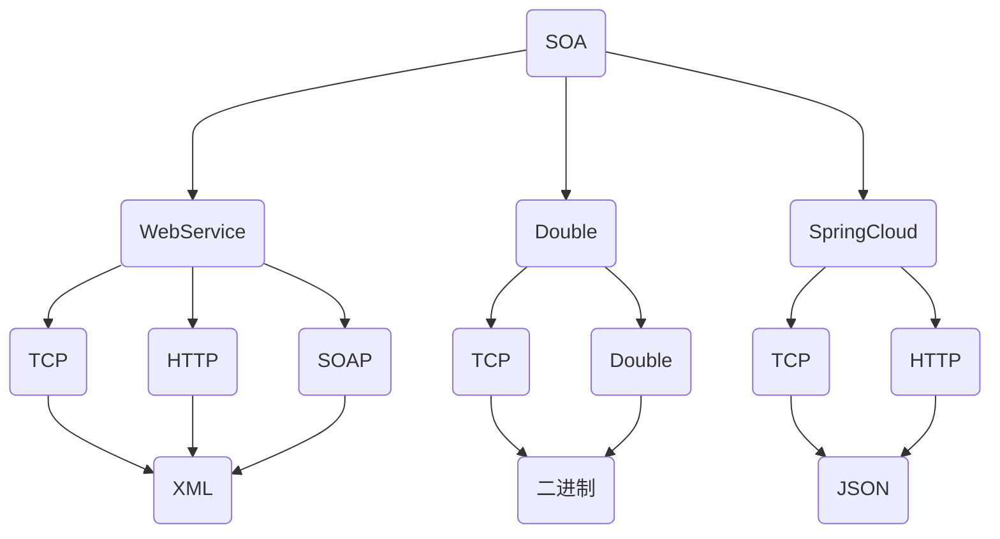

## 一、前置

#### 一、Double,WebService,SpringCloud协议分析

1、Double是什么?

> Double是一款高性能的java RPC框架。但是不能跨语言。

2、Double特点:

> double使用独有的double协议

3、画图分析：



## 二、Sentinel

#### 一、前置

1、Sentinel提供了两种限流策略

> 1. 基于QPS(每秒处理多少个请求)限流。
> 2. 基于线程池限流。
> 3. 信号量限流。

2、线程隔离|限流|熔断|降级

> 1. 线程隔离:sentinel在tomcat里开了一个线程池.
> 2. 限流:每在sentinel设置限流,就会开启一个线程池。
> 3. 降级:服务调用失败或者服务调用超时就会进行降级。
> 4. 熔断:降级次数达到阈值的时候进行降级。

#### 二、用法

1、脱离SpringCloud

```java
public class SentinelTest {


    public static void main(String[] args) {
        initSentinel();
        int x=0;
        while (x!=100){
            Entry entry=null;
            try {
                entry= SphU.entry("hello");
                System.out.println("你好我的世界");
            } catch (BlockException e) {
                System.out.println("超出设置");
            }finally {
                if (entry!=null) entry.exit();
            }
            x++;
        }
    }

    public static void initSentinel(){
        //创建规则集合
        List<FlowRule> rules=new ArrayList<>();
        //创建规则
        FlowRule rule=new FlowRule();
        //根据资源取出令牌
        rule.setResource("hello");
        //创建限流方式
        rule.setGrade(RuleConstant.FLOW_GRADE_QPS);
        //设置访问次数
        rule.setCount(10);
        rules.add(rule);
        FlowRuleManager.loadRules(rules);
    }
}
```

2、整合web

2.1、启动应用程序时加载规则。

```java
@SpringBootApplication
public class SentinelApplication {
    public static void main(String[] args) {
        initSentinel();
        SpringApplication.run(SentinelApplication.class, args);
    }
    //初始化Sentinel
    public static void initSentinel() {
        //创建规则集合
        List<FlowRule> rules = new ArrayList<>();
        //创建规则
        FlowRule rule1 = new FlowRule();
        //根据资源取出令牌
        rule1.setResource("index1");
        //创建限流方式
        rule1.setGrade(RuleConstant.FLOW_GRADE_QPS);
        //设置访问次数
        rule1.setCount(10);

        //设置第二个限流规则
        FlowRule rule2 = new FlowRule();
        //根据资源取出令牌
        rule2.setResource("index2");
        //创建限流方式
        rule2.setGrade(RuleConstant.FLOW_GRADE_QPS);
        //设置访问次数
        rule2.setCount(20);
        rules.add(rule1);
        rules.add(rule2);
        FlowRuleManager.loadRules(rules);
    }
}
```

2.2、整合(service)

```java
@Service
public class WebService {
    //对方法进行限流,value指定限流的规则源,blockHandler指定降级方法。
    @SentinelResource(value = "index1", blockHandler = "back")
    public String index1() {
        return "10QPS";
    }

    @SentinelResource(value = "index2", blockHandler = "back")
    public String index2() {
        return "20QPS";
    }

    //这里一定要加BlockException
    public String back(BlockException blockException) {
        return "降级了";
    }
}
```

2.3、@SentinelResource详细用法

```java
//对方法进行限流,value指定限流的规则源,blockHandlerClass指定需要降级的类,blockHandler指定降级类的方法,fallbackClass方法降级异常处理类,fallback异常处理方法。
@SentinelResource(value = "index", blockHandlerClass ={SentinelExceptionHandler.class},blockHandler = "ExceptionHandlerMethod1",fallbackClass = {SentinelFallBackMessage.class},fallback = "messages")
public String index(String name) {
    return name;
}
```

> 限流熔断处理

```java
public class SentinelExceptionHandler{
   public static String ExceptionHandlerMethod1(String name,BlockException blockException){
       if(blockException instanceof FlowException) return "限流";
       if (blockException instanceof DegradeException) return "熔断";
       return "未知错误";
   }
   public static String ExceptionHandlerMethod2(BlockException blockException){
       if(blockException instanceof FlowException) return "限流";
       if (blockException instanceof DegradeException) return "熔断";
       return "未知错误";
   }
}
```

> 内部错误处理

```java
public class SentinelFallBackMessage {
    public static String messages(){
        return "方法内部错误";
    }
}
```

#### 三、配置仪表盘

1、使用jar包 [sentinel-dashboard-1.8.2.jar](sentinel-dashboard-1.8.2.jar) 

1.1、使用此命令启动jar包:

```java
java -Dserver.port=8888 -Dcsp.sentinel.dashboard.server=localhost:8888 -Dproject.name=sentinel-dashboard-qianqiwei -jar sentinel-dashboard-1.8.2.jar
```

1.2、**注册注意事项**

> 定义本地规则,就不会注册到dashboard上。

```java
@SpringBootApplication
public class SentinelApplication {
    public static void main(String[] args) {
        //initSentinel(); 这里规则一定要注释掉。
        SpringApplication.run(SentinelApplication.class, args);
    }
    //初始化Sentinel
    public static void initSentinel() {
        //创建规则集合
        List<FlowRule> rules = new ArrayList<>();
        //创建规则
        FlowRule rule1 = new FlowRule();
        //根据资源取出令牌
        rule1.setResource("index1");
        //创建限流方式
        rule1.setGrade(RuleConstant.FLOW_GRADE_QPS);
        //设置访问次数
        rule1.setCount(10);

        //设置第二个限流规则
        FlowRule rule2 = new FlowRule();
        //根据资源取出令牌
        rule2.setResource("index2");
        //创建限流方式
        rule2.setGrade(RuleConstant.FLOW_GRADE_QPS);
        //设置访问次数
        rule2.setCount(20);
        rules.add(rule1);
        rules.add(rule2);
        FlowRuleManager.loadRules(rules);
    }
}
```

1.3、配置yaml

```yaml
spring:
  application:
    name: MySentinel
  cloud:
    sentinel:
      #配置注册服务路径
      transport:
        dashboard: localhost:8082
      #服务启动后直接注册到dashboard
      eager: true
```

#### 四、与nacos整合

1、下载服务: [nacos-server-2.0.3.zip](nacos-server-2.0.3.zip) 

2、配置注意事项:

> 1. /nacos/conf/cluster.conf 一定要把example后缀去掉(大坑)。
> 2. 配置数据库 [nacos-mysql.sql](C:\Users\15915\Documents\nacos-server-2.0.3\nacos\conf\nacos-mysql.sql) 

3、启动nacos,用户名跟密码都是nacos。

4、导入依赖:

```xml
<!-- https://mvnrepository.com/artifact/com.alibaba.csp/sentinel-datasource-nacos -->
<dependency>
    <groupId>com.alibaba.csp</groupId>
    <artifactId>sentinel-datasource-nacos</artifactId>
    <version>1.8.2</version>
</dependency>

```

5、配置服务:

```yaml
spring:
  application:
    name: MySentinel
  cloud:
    sentinel:
      #配置注册服务路径
      transport:
        dashboard: localhost:8084
      #服务启动后直接注册到dashboard
      eager: true
      datasource:
        ds:
          #配置nacos
          nacos:
            #nacos服务地址
            server-addr: localhost:8848
            #这些数据一定要与nacos相匹配
            dataId: SentinelConfig01
            groupId: SentinelConfigGroup01
            ruleType: flow
            username: nacos
            password: nacos
```

6、nacos下发配置(sentinel)

```json
[
    {
        "resource":"index", //规则源
        "limitApp":"default", //限流方式
        "grade":1, //1,QPS限流 2,线程池限流
        "count":2, //每秒限制几个
        "strategy":0,
        "controlBehavior":0,
        "clusterMode":false
    }
]
```

#### 五、限流策略

##### 一、滑动时间窗口

###### 一、问题

> 1. 当以秒为滑动时间窗口来进行限流时:当阈值为100(QPS)的时候,当第100ms突然来100个请求的时候,后面900ms为等待状态。

###### 二、解决

> 1. 滑动时间窗口:sentinel将一秒分成多个时间窗口,上一个时间窗口加上当前时间窗口是否大于阈值。大于阈值就降级。

##### 二、线程限流

> 1. 线程限流:sentinel限制的是业务线程个数,有一个计数器来记录线程个数,他并不会像sentinel一样开辟一个新的线程池。

#### 六、关联降级

> 一个方法降级之后,另一个请求也随着降级。

#### 七、预热

> 单机阈值随着预热时间上升而上升。

#### 八、排队等待

> 请求失败后等待多少秒后或者说超时了,进入降级。有点像trylock

#### 九、降级比例

> 规定时间之内(统计时长):(请求数(**最小请求数**)*错误(**比例阈值**))<请求出错个数,否则进行降级处理。

#### 十、热点数据

> 1. 根据参数数据进行限流:限流参数最好只有一个。超过阈值fallback


#### 十一、Sentinel整合RestTemplate

一、配置RestTemplate

```java
@Configuration
public class RestTemplateConfig {
    @Bean
    @SentinelRestTemplate(fallbackClass = ExceptionHandler.class, fallback = "fallback01", blockHandlerClass = ExceptionHandler.class, blockHandler = "handle")
    @LoadBalanced
    public RestTemplate restTemplate() {
        return new RestTemplate();
    }
}
```

二、熔断|降级|限流の处理

```java
@Component
public class ExceptionHandler {

    public static SentinelClientHttpResponse handle(HttpRequest request, byte[] body, ClientHttpRequestExecution execution, BlockException blockException) {
        String error="";
        if (blockException instanceof DegradeException){
            error="熔断了";
        }
        if (blockException instanceof FlowException){
            error="限流了";
        }
        if (blockException instanceof ParamFlowException){
            error="热点限流";
        }
        return new SentinelClientHttpResponse(error);
    }


    public static SentinelClientHttpResponse fallback01(HttpRequest request, byte[] body, ClientHttpRequestExecution execution, BlockException blockException) {
        return new SentinelClientHttpResponse("出错啦!");
    }

}
```

三、RestTemplate调用服务:

```java
@Service
public class WebServiceImpl {

    @Autowired
    private RestTemplate restTemplate;

    public String index() {
        return restTemplate.getForObject("http://provider/index", String.class);
    }

    public String delay() {
        return restTemplate.getForObject("http://provider/delay", String.class);
    }

    public Map<String, String> getMap(Map<String, String> map) {
        RestTemplateUtils<Map<String, String>> restTemplateUtils = new RestTemplateUtils<>();
        HttpEntity<Map<String, String>> httpEntity = restTemplateUtils.getHttpEntity(map);
        return restTemplate.postForObject("http://provider/getMap", httpEntity, Map.class);
    }

    public User getUsers(User user) {
        RestTemplateUtils<User> restTemplateUtils = new RestTemplateUtils<>();
        HttpEntity<User> httpEntity = restTemplateUtils.getHttpEntity(user);
        return restTemplate.postForObject("http://provider/getUsers", httpEntity, User.class);
    }

    public String error() {
        return restTemplate.getForObject("http://provider/error1", String.class);
    }

}
```

四、Controller接受调用:

```java
@RestController
public class WebController {
    @Autowired
    private WebServiceImpl webServiceImpl;

    @GetMapping("/index")
    public String index() {
        return webServiceImpl.index();
    }

    @GetMapping("/delay")
    public String delay() {
        return webServiceImpl.delay();
    }

    @PostMapping("/getMap")
    public Map<String, String> getMap(@RequestBody Map<String, String> map) {
        return webServiceImpl.getMap(map);
    }

    @PostMapping("/getUsers")
    public User getUsers(@RequestBody User user) {
        return webServiceImpl.getUsers(user);
    }

    @GetMapping("/error1")
    public String error() {
        return webServiceImpl.error();
    }


}
```

#### 十二、nacos、sentinel、SpringGateWay整合

 一、配置GateWay

```yaml
spring:
  application:
    name: SpringGateWay
  cloud:
    nacos:
      discovery:
        server-addr: localhost:8848
        username: qianqiwei
        password: Qianqiwei2003817
    sentinel:
      transport:
        dashboard: localhost:8888
      eager: true
    gateway:
      discovery:
        locator:
          enabled: true

      routes:
        - id: v1
          uri: lb://consumer
          predicates:
            - Path=/qianqiwei/v1/**
          filters:
            - StripPrefix=2


server:
  port: 8083

feign:
  sentinel:
    enabled: true
```


二、配置拦截器

```java
@Component
public class WebFilter implements Ordered, GlobalFilter {

    @Override
    public Mono<Void> filter(ServerWebExchange exchange, GatewayFilterChain chain) {
        ServerHttpRequest request = exchange.getRequest();
        HttpHeaders headers = request.getHeaders();
        List<String> list = headers.get("token");
        System.out.println(list);
        if (list!=null){
            System.out.println("数据接受成功"+list.get(0));
            return chain.filter(exchange);
        }
        System.out.println("112");
        ServerHttpResponse response = exchange.getResponse();
        response.setStatusCode(HttpStatus.UNAUTHORIZED);
        return response.setComplete();
    }

    @Override
    public int getOrder() {
        return 0;
    }
}
```

三、详细配置看SpringCloudNetifx


## 三、nacos

#### 一、注册到nacos

```yaml
spring:
  application:
    name: NacosClient01
  cloud:
    sentinel:
      #取消懒加载
      eager: true
      transport:
        dashboard: http://127.0.0.1:8888
    nacos:
      #注册发现
      discovery:
        #nacos服务地址
        server-addr: http://127.0.0.1:8848
        #用户名与密码
        username: qianqiwei
        password: Qianqiwei2003817


server:
  port: 8080
```


#### 二、下发配置文件

```yaml
spring:
  application:
    name: nacos-config01
  cloud:
    nacos:
      config:
        #nacos服务地址
        server-addr: localhost:8848
        #用户名与密码
        username: qianqiwei
        password: Qianqiwei2003817
        #上传文件的格式
        file-extension: yaml
        
  profiles:
    #生产模式
    active: dev
    #上传配置文件也要加上端口号
server:
  port: 8080    
```


> @Reference //做局部动态刷新

#### 三、配置集群

> 1. 配置cluster.conf 
> 2. 配置application.properties 端口号

## 四、配置Apollo

> 1. Apollo下载地址:[连接在此](https://github.com/apolloconfig/apollo/releases/tag/v1.9.1)
> 2. 解压 : apollo-configservice apollo-adminservice  apollo-portal-1.9.1
> 2. 好处:配置及时更新

#### 一、数据库修改

> 1. 修改: apollo-configservice-1.9.1/config/application-github.properties 数据库为自己的数据库
> 2. 修改: apollo-adminservice-1.9.1/config/application-github.properties 数据库为自己的数据库
> 3. 修改: apollo-portal-1.9.1/config/application-github.properties 数据库为自己的数据库
> 4. 分别创建数据库 [ApolloConfigDB.sql]("./ApolloConfigDB.sql"),[ApolloPortalDB.sql](./ApolloPortalDB.sql)

#### 二、启动

> 1. java -jar apollo-configservice-1.9.1.jar
> 2. java -jar apollo-adminservice-1.9.1.jar
> 3.  java -jar apollo-portal-1.9.1.jar

#### 三、整合Spring

1、导入依赖

```xml
<!-- https://mvnrepository.com/artifact/com.ctrip.framework.apollo/apollo-client -->
<dependency>
    <groupId>com.ctrip.framework.apollo</groupId>
    <artifactId>apollo-client</artifactId>
    <version>1.9.1</version>
</dependency>

```

备注:

> 1. 链接远程服务器在环境运行时中加上: -Dapollo.configService=http://www.qianqiwei.com:8080
> 2. 运行环境时: -Denv=dev

2、链接Apollo(yaml)

```yaml
spring:
  application:
    #这里可配可不配,下发配置只识别app-id
    name: consumer

app:
  id: consumer-01
apollo:
  meta: http://www.qianqiwei.com:8080
  bootstrap:
    #空间(分组)
    namespaces: application
    #启动配置下发
    enabled: true
    #饥饿拉取数据
    eagerLoad:
      enabled: true
    #集群的名字
  cluster: qianqiwei
```

3、配置检测:

```java
@Configuration
public class ApolloConfig {
    @Bean
    public void config() {
        //获取配配置
        Config config = ConfigService.getAppConfig();
        config.addChangeListener(event -> {
            //监听空间
            String namespace = event.getNamespace();
            //监听key是否发生改变
            for (String key : event.changedKeys()) {
                //拿到更改的key
                ConfigChange change = event.getChange(key);
                //输出key
                System.out.println(String.format("空间:%s:[key值:%s\t旧的值:%s\t新的值:%s]", namespace,change.getPropertyName(),change.getOldValue(),change.getNewValue()));
            }
        });
    }
}
```

4、启动jar包:

> java -Denv=dev -jar youJar.jar

## 五、Skywalking

> 1、自行下载[安装包]([Downloads | Apache SkyWalking](https://skywalking.apache.org/downloads/))和[Agent](./apache-skywalking-apm-8.7.0\apache-skywalking-apm-bin\agent)(整合spring)或者本地有[链接](./apache-skywalking-apm-8.7.0.tar.gz)
>
> 2、解压启动
>
> 3、链接Skywalking dashboard : http://服务地址:8080/
>
> 4、Skywalking 还会开启数据收集端口 http: 12800 grpc: 11800


#### 一、整合spring

> 无侵入式链路追踪框架

1、更改环境运行时:

```xml
-javaagent:\路径\skywalking-agent.jar
-Dskywalking.agent.service_name=名字
-Dskywalking.collector.backend_service=服务名:11800
```

2、如果要整合SpringCloudGateWay、导入插件即可。

