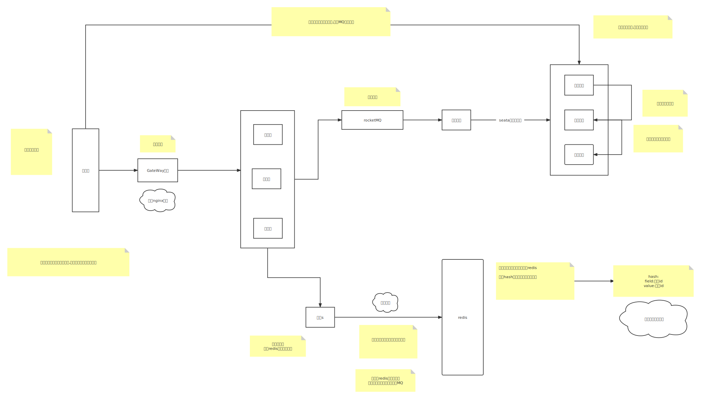

# 一、安装

## 一、下载redis

> 链接[redis下载链接](https://redis.io/download/)

## 二、编译源码

> make PREFIX=[编译到你的路径] install

## 三、配置环境变量

> export REDIS_HOME=/opt/redis
> export PATH=$PATH:$REDIS_HOME/bin

## 四、创建服务

> 1. 到redis目录下(你下载的文件)/utils执行:install_server.sh
>
> 2. 如果执行报错就注释掉一下代码:
>
>    ```bash
>    #bail if this system is managed by systemd
>    #_pid_1_exe="$(readlink -f /proc/1/exe)"
>    #if [ "${_pid_1_exe##*/}" = systemd ]
>    #then
>    #       echo "This systems seems to use systemd."
>    #       echo "Please take a look at the provided example service unit files in this directory, and adapt and install them. Sorry!"
>    #       exit 1
>    #fi
>    ```
>
>    3. 一路回车服务创建成功。
>    4. 启动服务systemctl start redis_6379 (你不用手动启动它已经帮你自动启动并且配置开机启动)

> 注意:配置文件以及服务都是随着你的端口号动态的变化。并且配置文件在你创建的期间已经告诉你了。并且你可以配置多个服务。

## 五、redis默认存储路径

> 1. rdb:/var/lib/redis
> 2. log:/var/log/

## 六、注意

> 1. redis如果要对外提供访问一定关闭:protected-mode no
> 2. 注释掉:bind 127.0.0.1 -::1

# 二、概念

## 一、redis是单线程的还是多线程的?

> redis是单线程单进程的。
>
> redis一次只能处理一个业务请求(排队执行),这样能保证原子操作,但是这样并不能代表redis性能低下,redis寻址是ns级的,并且在实际开发中,比如说MySQL你要保证原子操作,你就要给表上行锁(inndb),这样一样也只有一个线程进行操作。

## 二、redis一共有多少个数据库?

> 默认为16个数据库。配置文件可以修改。

## 三、redis解决了什么问题?

> redis主要的是解决了读请求。

# 三、基本数据类型(要点)

## 一、字符串数据类型

> 1. 查看value 是什么类型的: object encoding  [key]
> 1. 以字符集的方式启动redis: redis-cli --raw
> 1. redis二进制安全:redis以字节的方式存储数据,只要将数据传输到redis中redis保存的就是什么样的。不会被篡改。没有类型的区分。说白了无论你以UTF-8字符集存储数据还是GBK字符集存储数据,redis只会记录16进制编码。
> 1. embstr:普通字符串类型。
> 1. int:整数类型。
> 1. raw:当字符的长度大于44的时候才会使用raw类型。包括字符串追加。

## 二、list类型

> 1. redis中的list采用双向链表的形式。
> 2. lpush:指向从右往左,pre指向的是下一个元素。
> 3. rpush:指向从左向右,next指向的是下一个元素。
> 4. lpop:从左往右弹出元素,每次弹第一个元素。
> 5. rpop:从右往左弹出元素,每次弹出第一个元素。
> 6. blpop&brpop: 将数据弹出,如果key不存在的时候或者当前key元素为空,会进行阻塞。

## 三、set类型

> 1. 作用:去重
> 2. 查看交集:sinter [集合key的名称]
> 3. 查看交集并且存储到另外的一个key里面:sinterstore [目标key] [集合名称] 
> 4. 查看并集: sunion [集合key的名称]
> 5. 查看并集并且储存到另外一个key里面: sunionstore [目标key] [集合名称]
> 6. 查看差集:sdiff [集合key] [参照集合key]
> 7. 随机取出集合中的元素:srandememer [集合的名称] [随机取出的个数] (如果为整数去处一个去重的结果集,负数带有重复的结果集)

## 四、zset类型

> 1. 作用:为集合中的元素进行排序
> 2. 添加元素:zadd [集合的名称] [分值] [元素名称]
> 3. 正向取出数据(由小到大):zrange  [集合名称] [开始位置] [最后位置]
> 4. 反向取出数据(由大到小):zrevrange [集合名称] [开始位置] [最后位置] 
> 5. 对数值进行操作:zincrby  [集合名称] [增长的分数] [要增长的数值名称]
> 6. 数据结构:跳跃表

# 四、数据类型进阶

## 一、管道通信

> 1. 通过管道操作redis: nc [地址] [端口号]
> 2. 通过管道发送多个命令: echo -e "set username liudehua\n append username 666 \n get username" | nc localhost 6379

## 二、发布订阅

> 1. 推送消息:publish [订阅名称] [消息内容]
> 2. 订阅消息:SUBSCRIBE [订阅名称....] ,你可以订阅多个消息来获得不同的消息。你订阅之后收到消息才会记录!

## 三、redis事物

> 1. 开启事物:MULTI  
> 2. 提交事物:exec
> 3. watch: 当watch当前key并开启当前事物,如果其他事物更改了当前的key并且提交,当前事物修改此key将无效。

## 四、Redis内存管理

> 1. 在redis配置文件中找打这个选项:MEMORY MANAGEMENT
> 2. maxmemory <bytes>设置最大的内存。

### 一、官方解释

> - **noeviction**:返回错误当内存限制达到并且客户端尝试执行会让更多内存被使用的命令（大部分的写入指令，但DEL和几个例外）
> - **allkeys-lru**: 尝试回收最少使用的键（LRU），使得新添加的数据有空间存放。
> - **volatile-lru**: 尝试回收最少使用的键（LRU），但仅限于在过期集合的键,使得新添加的数据有空间存放。
> - **allkeys-random**: 回收随机的键使得新添加的数据有空间存放。
> - **volatile-random**: 回收随机的键使得新添加的数据有空间存放，但仅限于在过期集合的键。
> - **volatile-ttl**: 回收在过期集合的键，并且优先回收存活时间（TTL）较短的键,使得新添加的数据有空间存放。

## 五、注意:

> 1. 当给key设置过期时间之后过期时间将会失效。

# 五、模块拓展

## 一、布隆过滤器

### 一、准备 

> 1. 下载布隆过滤器:文件夹已经准备好了。或者你也可以在github上下载[bloom](https://github.com/RedisBloom/RedisBloom/)
> 2. 解压缩包,并且make install,当前目录生成redisbloom.so文件。
> 3. 启动redis和布隆过滤器:redis-server [你的配置文件] --loadmodule [模块路径] ./redisbloom.so
> 4. 为什么要使用布隆过滤器?为了解决缓存穿透。

### 二、什么是布隆过滤器

> 1. 在redis中主要解决缓存穿透的问题。
> 2. 布隆过滤器的优点:查询插入速度极快,占用空间少(由二进制数组存储)
> 3. 布隆过滤器的缺点:当数据过多的时候会产生误判的现象。布隆过滤器不能保证100%有值。

### 三、布隆过滤器存储与查找

> 1. 存储: 当有值存入到布隆过滤器的时候,这时候当前值会进行三次哈希(调用内部映射函数)(你自己可以进行设定),并计算出下标,将与之对应的下标值设为1(由于是二进制存储,只有0或者1)。
> 2. 查询:会将要查询的值进行三次hash(调用内部映射函数),如果与之对应的下标的值都是1(如果有一个下标的值为0这个元素一定不存在)就会判定这个值可能存在与之返回。
> 3. 如果要提升准确率就将二进制数组长度变长,让hash碰撞数量减少。

### 四、布隆过滤器解决redis缓存穿透

> 1. 如果布隆过滤器中没有要找的值,就直接返回空值,就避免从数据库中查找。

###  五、布隆过滤器的使用

| 命令       | 说明                                                         |
| ---------- | ------------------------------------------------------------ |
| bf.add     | 只能添加元素到布隆过滤器。                                   |
| bf.exists  | 判断某个元素是否在于布隆过滤器中。                           |
| bf.madd    | 同时添加多个元素到布隆过滤器。                               |
| bf.mexists | 同时判断多个元素是否存在于布隆过滤器中。                     |
| bf.reserve | 以自定义的方式设置布隆过滤器参数值，共有 3 个参数分别是 key、error_rate(错误率)、initial_size(初始大小)。 |

### 六、注意:

> 1. 如果要查找的数值没有在redis缓存中,并且当前数值进行多次hash之后,下标值都为1,有可能会发生穿透。但是概率为1%

## 二、RedisJson(拓展)

### 一、准备

> 1. 下载RedisJson:这里已经准备好了,编译好的文件已经在当前文件夹中。

### 二、命令

#### 一、前置

> 1. JSON.set [document] [collection] [data]
> 2. document:相当于数据库的database
> 3. collection:相当于数据库的table
> 4. data:相当于数据库表字段

#### 二、创建JSON

##### 一、命令

```bash
JSON.set [document] [collections] [data]
```

##### 二、注意

>  注意:创建Json的时候,一定要创建根($),每个key(redis)对应一个JSON

##### 三、用法

> 1. 普通创建
>
>    ```bash
>    JSON.set doc1 $ '{"username":"qianqiwei","password":"qianqiwei","age":18}'
>    ```
>
> 2. 联合创建
>
>    ```bash
>     JSON.set users $ '{"username":{"user1":"qianqiwei","user2":"liudehua"},"age":100}'
>    ```

#### 三、查询JSON属性字段

##### 一、命令:

```bash
JSON.GET [document]  $..[属性名称] [子属性名称]...
```

##### 二、字段示例:

```bash
 JSON.set users $ '{"username":{"user1":"qianqiwei","user2":"liudehua"},"age":100}'
```

##### 三、用法:

```bash
JSON.get users $..username.user2
```

#### 四、JSON为属性中的数组添加元素

##### 一、命令

```bash
JSON.ARRAPPEND [document] $..[字段名称] '[数组元素1]' '[数组元素2]'.... #除了number类型不用''
```

##### 二、字段示例

```bash
JSON.set username $ '{"username":["qianqiwei","liudehua"],"age":12}'
```

##### 三、用法:

```bash
JSON.ARRAPPEND username $..username '"wanganshi"'
JSON.ARRAPPEND doc $..users '{"username":"wanganshi","age":12}' #json
```


#### 五、JSON中获取属性中数组的下表

##### 一、命令

```bash
JSON.ARRINDEX [document] $..'[字段名称]'.'[数组字段]'
```

##### 二、注意

> 数组字段必须为数字

##### 三、字段示例

```bash
JSON.set username $ '{"username":["qianqiwei","liudehua"],"age":12}'
```

##### 四、用法

```bash
JSON.ARRINDEX username $..username '"wanganshi"'  #如果当前数组没有这个字段就返回-1
```

#### 六、获取数组的长度

##### 一、命令

```bash
JSON.ARRLEN [document] $..[数组字段名称]
```

##### 二、示例

```bash
JSON.set username $ '{"username":["qianqiwei","liudehua"],"age":12}'
```

##### 三、用法

```bash 
JSON.ARRLEN username $..username
```

#### 七、删除文档中的元素

##### 一、命令

```bash
JSON.DEL [document] $..[属性字段]
```

##### 二、示例

```bash
JSON.set username $ '{"username":["qianqiwei","liudehua"],"age":12}'
```

##### 三、用法

```bash
JSON.DEL username $..username
```

#### 八、清除当前文档中的元素所对应的元素

##### 一、命令

```bash
JSON.CLEAR doc $.*
```

##### 二、示例

```bash
JSON.set username $ '{"username":["qianqiwei","liudehua"],"age":12}'
```

##### 三、用法

```bash
json.clear username $.*
```

#### 九、批量获取document的属性

##### 一、命令

```bash
JSON.MGET [document01][document02] $..[属性值]
```

##### 二、示例

```bash
JSON.set username $ '{"username":["qianqiwei","liudehua"],"age":12}'
JSON.set username $ '{"username":["qianqiwei","qianqiwei"],"age":12}'
```

##### 三、用法

```bash
json.mget username username2 $.*
```

#### 十、查看当前有哪些属性

##### 一、命令

```bash
JSON.OBJKEYS [document] $..[属性值]
```

##### 二、示例

```bash
JSON.set username $ '{"username":["qianqiwei","liudehua"],"age":12}'
```

##### 三、用法

```bash
JSON.objkeys username $
```

##### 十一、查看当前属性值的长度(字符串)

##### 一、命令

```bash
json.strlen [document] $..[属性]
```

##### 二、示例

```bash
JSON.set doc1 $ '{"username":"qianqiwei","password":"qianqiwei","age":18}'
```

##### 三、用法

```bash
json.strlen doc1 $..username
```

#### 十二、追加当前属性对应的字符串

##### 一、命令

```bash
JSON.STRAPPEND [document] $..[属性] '"[字符串]"'
```

##### 二、示例

```bash
JSON.set doc1 $ '{"username":"qianqiwei","password":"qianqiwei","age":18}'
```

##### 三、用法

```bash
 JSON.STRAPPEND doc1 $..username '"666"'
```

#### 十三、获取当前属性字符串的长度

##### 一、命令

```bash
JSON.STRLEN [document] $..[属性名称]
```

##### 二、示例

```bash
JSON.set doc1 $ '{"username":"qianqiwei","password":"qianqiwei","age":18}'
```

##### 三、用法

```bash
JSON.STRLEN doc1 $..username
```

#### 十四、获取当前属性的类型

##### 一、命令

````bash
SON.TYPE [document] $..[属性]
````

##### 二、示例

```bash
JSON.set doc1 $ '{"username":"qianqiwei","password":"qianqiwei","age":18}'
```

##### 三、用法

```bash
json.type doc1 $..age
```

#### 十五、数组插入元素

##### 一、命令

```bash
JSON.ARRINSERT [document] $..[字段名称] [索引下标] '[字段名称]'
```

##### 二、示例

```bash
JSON.set username $ '{"username":["qianqiwei","liudehua"],"age":12}'
```

##### 三、用法

```bash
JSON.ARRINSERT username $..username 0 '"qiqi"'
```

##    四、RediSearch基本使用(Hash)

> 目前rediSearch不太稳定

### 一、创建客户端(基本)

```java
//创建jedis
Jedis resource = new JedisPool("192.168.1.13", 6378).getResource();
//创建索引
Client search=new Client("index",resource);
```

### 二、创建索引(基本)

```java
//设置索引属性
IndexDefinition indexDefinition=new IndexDefinition();
//一般设置中文分词就可
indexDefinition.setLanguage("chinese");
//设置哪些属性需要被索引以及索引类型
Schema schema=new Schema();
schema.addField(new Schema.Field(FieldName.of("username"), Schema.FieldType.FullText));
schema.addNumericField("age");
schema.addField(new Schema.Field(FieldName.of("address"), Schema.FieldType.FullText));
//创建索引
redisSearchCommand.createIndex(indexName,indexDefinition,schema);
```

### 三、数据设置到索引中(基本)

```java
 List<User> users=new ArrayList<>();
        users.add(new User("钱 琪 炜",13,"湖 北 宜 昌"));
        users.add(new User("张 三",15,"湖 北 武 汉"));
        users.add(new User("李 四",67,"湖 北 皇 室"));
        users.add(new User("王 武",45,"湖 北 酒 店"));
        users.add(new User("赵 六",56,"湖 北 医 院"));
        users.add(new User("田 七",34,"湖 北 日 本"));
        users.add(new User("小 码",67,"湖 北 九 州"));
        users.add(new User("赵 子 龙",23,"湖 北 黄 沾"));
        users.add(new User("王 安 石",45,"湖 北 九 门"));
        users.add(new User("李 白",12,"湖 北 把 关"));
        users.add(new User("小 李 子",45,"湖 北 立 本"));
        users.add(new User("就 骂 吧",56,"湖 北 发 给 对 方"));
        users.add(new User("手 机",12,"湖 更 好"));
        users.add(new User("华 为",23,"湖 北 第 三 方"));
        users.add(new User("o p p o",34,"湖 北 让 他"));
        users.add(new User("日 本",67,"湖 北 第 三 方"));
        redisSearchCommand.createIndexDocumentByObj(indexName,users);
```

### 四、查询索引值

```java
 Query query=new Query(value);
 //设置中文分词查询
 query.setLanguage("chinese");
 //查询高亮显示
 query.highlightFields("username");
 //查询
 List<Document> queryList = redisSearchCommand.query(indexName, query);
 return queryList;
```

### 五、工具类(stater)整合

> 详情看本地目录

# 六、Redis备份恢复(RDB)

## 一、前置知识

> 1. 进程之间的数据是隔离的。
> 2. 子进程是不能看见父进程的数据(除非你在父进程定义全局变量)。
> 3. 在linux中你要定义一个全局变量(当前线程中所有子进程都可看见): export [变量名称]
> 4. 子进程定义全局变量父进程是看不见的。
> 5. 子进程修改数据不影响父进程的数据。父进程修改也是不会影响子进程的数据。

## 二、写时复制原理(重要)

> 1. 内存:redis其实将数值存储到自己的虚拟内存,然后虚拟内存的数值映射到物理内存当中。
> 2. 内存分配问题:通过以上前置知识知道当父线程创建子进程的时候,子进程可以看见父进程的数据,其实子进程的数值与父进程的数值指向的其实是同一个内存地址。
> 3. 进程修改的问题:进程之间修改数据并不相互影响,当其中一个进程进行更改的时候,他会在内存中开辟一个新的空间,并指向它。
> 4. 写时复制:当父线程创建子线程的时候,父线程与子线程并不会发生复制,子线程其实得到的父线程的数值内存指向。所以说创建子线程的时候速度更快。
> 5. 如何创建:父线程调用fork()创建一个子进程。

## 三、Redis备份(RDB)

> 1. 备份过程:当要进行数据备份的时候,redis会开辟一个新的进程(子进程),当备份的时候父线程数据更新,子进程的数据并不会跟这更新,还是原来的数据。说白了就是备份的就是当前时间节点的数据(时点数据),不会因为父线程的变化而变化。
> 2. 好处:创建速度快,节省内存(只有指针指向),以后台的形式备份数据。

## 四、备份数据Command(RDB)

> 1. save:前台阻塞备份(不推荐)
> 2. bgsave:后台执行备份(推荐)

## 五、备份配置文件参数(RDB)

> 1. save <seconds> <changes> [<seconds> <changes> ...] :备份自动触发策略:在多少秒之内至少更新了多少次请求。将其设置为save ""你就成功关闭RDB啦!
> 2. dbfilename rdump.rdb: rdb文件名称
> 3. dir /var/lib/redis/6379:rdb文件路径

## 六、弊端(RDB)

> 1. 不支持拉链:备份文件只有一个dump,每备份一次就会覆盖一次。在mysql中可以有多个备份文件(binlog)
> 2. 丢失的数据相对于多一点:在save中可以进行设置,如果设置为一个小时备份一次的话,中途redis宕机了,就丢一个小时的数据。

## 七、优点(RDB)

> 1. 恢复的速度相对比较快。

## 八、存储方式(全量)

> 1. 二进制存储

# 七、Redis备份与恢复(AOF)

> 思想:类似于binlog,记录的都是增删改操作(DML与DDL语句)

## 一、机制

> 1. redis的写操作记录到文件中。
> 2. 丢失数据少:每对redis进行操作,都会记录到AOF文件当中。
> 3. 在redis中AOF与RDB都可以同时开启。如果都开启要对数据进行恢复redis默认使用AOF进行数据恢复。
> 4. AOF首先会跟RDB文件一样记录全量的数据,后续只需要记录写操作即可。
> 5. 立即重写AOF:BGREWRITEAOF

## 二、问题解决

### 一、体积问题

> 1. RDB:记录的是redis当中的全量数据,他是随着redis数据大小而变化的。当redis中的数据变小的时候,当再次备份的时候,RDB文件体积也会相应的减少。
> 2. AOF:首先会保存redis中的全量数据(为了后续的写操作),后续会不停的记录写操作,体积无限量增大。直到最后体积达到T级别。之后的恢复就会变的巨慢。

### 二、解决AOF文件体积过大的问题(重写机制)

#### 一、Redis4.0之前解决方案

> 1. 删除抵消的命令:
>
>    ```bash
>    #redis命令:
>    sadd username qianqiwei zhansan lisi wangwu 
>    del username ;
>    #AOF中像这样相互抵消的命令不做记录。
>    ```
>
> 2. 合并重复的命令:
>
>    ```bash
>    #redis命令
>    set num 12
>    incr num 
>    incr num
>    incr num
>    incr num
>    #AOF中像这样重复的命令他会直接合并成,保留最后的结果: 
>    set num 16
>                                                                            
>    ```

#### 二、Redis4.0之后的解决方案

> 1. 当AOF的体积或者达到一定的阈值的时候,就会重新生成AOF文件(appendonly.aof.2.incr.aof)并且覆盖原来的文件,生成新的AOF文件来达到体积减少。
>    1. auto-aof-rewrite-percentage 100:体积增长至原来的100%时触发重写。
>    2. auto-aof-rewrite-min-size 64mb:体积达到规定的大小时触发重写。

##  三、开启AOF

> 1. 在redis中默认是关闭AOF需要手动打开:
>    1. 找到APPEND ONLY MODE下的appendonly no 设置为:appendonly yes
>    2. 文件类型:appendonly.aof

## 四、触发级别(同步策略)

#### 一、前置知识

> 1. 当数据要写入到磁盘时,系统内核会开辟一个缓冲区,当缓冲区数据写满了,才会刷入到磁盘中。
> 2. Flush:只要调用flush缓存中的数据立即写入到磁盘中。

``` bash
appendfsync always  #redis只要向缓冲区写入数据,就立马调用flush,将数据及时的写入到磁盘当中。丢失数据只会丢失flush之前的数据,保证了数据的可靠性。
appendfsync everysec #每秒钟调用一次flush
appendfsync no  #redis向AOF文件中写入数据的时候,首先会写入到缓冲区中,直到缓存区写满之后才会将数据写入到磁盘。当丢数据的时候只会丢失buffer大小的数据。
```

## 七、AOF与RDB混合模式

> 1. 开启混合模式(默认):aof-use-rdb-preamble yes
> 2. 全量数据以RDB文件的形式保存。增量数据以AOF的形式保存。
> 3. 优点:恢复速度超快。因为RDB文件以二进制的形式保存。

## 六、AOF存储文件分析

### 一、未开启混合模式

> 1. appendonly.aof.7.base.aof:保存的是redis全量数据(命令模式保存)
> 2. appendonly.aof.7.incr.aof:保存的增量数据。

## 二、开启混合模式

> 1. appendonly.aof.2.base.rdb:保存的是redis当中的全量数据。
> 2. appendonly.aof.2.incr.aof:保存的是增量数据。

# 八、Redis集群

## 一、前置知识

### 一、主从关系

> 1.  主-主:主机之间相互同步数据。都可以进行读写。
> 2. 主-从:主机负责写入,从机负责从主机同步数据,负责读出数据。
> 3. 主-备:主机负责读写,从机只负责从主机读取数据。相当于对主机数据做全量备份。
> 4. 微服务中主要对主机保证高可用。 

### 二、微服务值拆分理论之AKF理论

> 1. x轴:主从集群。主机负责读写,从机只需要保存数据主机,读取数据即可。
> 2. y轴: 将redis拆成多个实例保存不同的数据(责任划分)。
> 3. z轴:类似与MySQL中的分库分表。规定一个redis中只能存储多少个数据(数据分区)。
> 4. x跟y:都可以融合。

## 二、配置主从集群

### 一、搭建集群(主从)

> 1. 跟随主机: REPLICAOF [地址] [端口号]  
> 2. 恢复主节点: REPLICAOF  no one

### 二、从节点

> 1. 开启集群之后,从节点的数据会丢弃,请做好备份!!!
> 2. 这时候从节点是不允许修改数据的。遵循主从原则。
> 3. 从节点是否舍弃数据取决于当前备份文件是否记录之前跟随的节点.AOF就没记.
> 4. 当从节点挂了之后 ,再次连接之前的数据不会落RDB(RDB会记录之前的追随的主节点),继续写入数据.
> 5. 当从节点挂了之后,如果是混合模式,就会丢弃之前的数据(AOF不会记录之前追随的节点).从新创建AOF文件.

### 三、配置文件(REPLICATION)

> 1. 配置主从:replicaof <masterip> <masterport>
> 2. 未同步完成数据是否可查 : replica-serve-stale-data yes //关闭之后只能同步完成之后客户端才能查.
> 3. 配置只读:replica-read-only yes //开启之后数据从节点只能进行读取,关闭之后数据既可以写又可以读.
> 4. 传输:repl-diskless-sync yes  //开启通过网络传输,关闭通过RDB传输
> 5. 恢复:repl-backlog-size 1mb  //redis主从之间会维护一个队列,当某一个从机突然宕机了,如果从机能在短时间恢复并且队列中的数据没有溢出最大设定大小,就还是通过队列追加到从机中,否则就直接走RDB.

## 三、哨兵

### 一、前置

> 当搭建主从集群的时候,当主宕掉之后,需要人为的去进行恢复,导致成本变得很高。哨兵模式就是维护主从节点之间的恢复。

### 二、配置及使用

#### 一、配置

> 1. 配置:
>
>    ```bash
>    sentinel monitor [名称] [地址] [端口号] [权重]
>    ```
>
> 2. 说明:
>
>    ```bash
>    port 26380 #配置sentinel端口号
>        daemonize yes #是否以守护线程启动
>    sentinel monitor master 127.0.0.1 6379 2 #你所监控的主节点
>    ```

#### 二、使用

> 1. 开启sentinel:
>
>    ```bash
>    redis-server sentinel_6380.conf --sentinel
>    ```

### 三、说明

> 1. 当主机挂掉之后,哨兵监控的服务中就会从中选出一台作为主机。

## 四、cluster模式(高可用集群模式)

> 1. 哨兵模式能保证主节点挂掉之后,能选举出新的主节点,由于节点之间采用的是主从架构,当主节点挂掉之后,大量的写请求不能被访问,访问瞬断(因为要选举),所以cluster模式能解决这个问题。
> 2. 高可用集群模式:高可用集群中分布各种小的集群,对摄入的key值进行hash计算然后取模,然后得到主节点hash插槽的范围然后设入。这样可以实现分流。


### 一、启动之前的准备工作

> 1. 打开节点集群(redis.conf):
>
>    ```bash
>    ################################ REDIS CLUSTER  ###############################
>    
>    # Normal Redis instances can't be part of a Redis Cluster; only nodes that are
>    # started as cluster nodes can. In order to start a Redis instance as a
>    # cluster node enable the cluster support uncommenting the following:
>    #
>    //打开集群模式
>    cluster-enabled yes
>    
>    # Every cluster node has a cluster configuration file. This file is not
>    # intended to be edited by hand. It is created and updated by Redis nodes.
>    # Every Redis Cluster node requires a different cluster configuration file.
>    # Make sure that instances running in the same system do not have
>    # overlapping cluster configuration file names.
>    #
>    # cluster-config-file nodes-6379.conf
>    
>    # Cluster node timeout is the amount of milliseconds a node must be unreachable
>    # for it to be considered in failure state.
>    # Most other internal time limits are a multiple of the node timeout.
>    #
>    # cluster-node-timeout 15000
>    
>    # The cluster port is the port that the cluster bus will listen for inbound connections on. When set
>    ```
>
> 2. 如果报这种错误:
>
>    ```bash
>    Node 127.0.0.1:6379 is not empty. Either the node already knows other nodes (check with CLUSTER NODES) or contains some key in database 0.
>    ```
>
>    > 删除rdb文件以及aof文件
>
> 3. 集群节点必须在6个及以上。

### 二、查看集群帮助命令

> 1.  redis-cli --cluster help 
>
> 2. 显示
>
>    ```bash
>    Cluster Manager Commands:
>      create         host1:port1 ... hostN:portN
>                     --cluster-replicas <arg>
>                     #[arg]一个主节点中从节点的个数(redis自动分配)
>      check          host:port
>                     --cluster-search-multiple-owners
>      info           host:port
>      fix            host:port
>                     --cluster-search-multiple-owners
>                     --cluster-fix-with-unreachable-masters
>      reshard        host:port
>                     --cluster-from <arg>
>                     --cluster-to <arg>
>                     --cluster-slots <arg>
>                     --cluster-yes
>                     --cluster-timeout <arg>
>                     --cluster-pipeline <arg>
>                     --cluster-replace
>      rebalance      host:port
>                     --cluster-weight <node1=w1...nodeN=wN>
>                     --cluster-use-empty-masters
>                     --cluster-timeout <arg>
>                     --cluster-simulate
>                     --cluster-pipeline <arg>
>                     --cluster-threshold <arg>
>                     --cluster-replace
>      add-node       new_host:new_port existing_host:existing_port
>                     --cluster-slave
>                     --cluster-master-id <arg>
>      del-node       host:port node_id
>      call           host:port command arg arg .. arg
>                     --cluster-only-masters
>                     --cluster-only-replicas
>      set-timeout    host:port milliseconds
>      import         host:port
>                     --cluster-from <arg>
>                     --cluster-from-user <arg>
>                     --cluster-from-pass <arg>
>                     --cluster-from-askpass
>                     --cluster-copy
>                     --cluster-replace
>      backup         host:port backup_directory
>      help
>                      
>    For check, fix, reshard, del-node, set-timeout, info, rebalance, call, import, backup you can specify the host and port of any working node in the cluster.
>                      
>    Cluster Manager Options:
>      --cluster-yes  Automatic yes to cluster commands prompts
>    ```

### 三、简单搭建集群

#### 一、命令

```bash
redis-cli --cluster create [地址:端口号] [地址:端口号] [地址:端口号] [地址:端口号] [...] --cluster-replicas [从节点个数]
```

#### 二、示例

```bash
redis-cli --cluster create 127.0.0.1:6370 127.0.0.1:6371 127.0.0.1:6372 127.0.0.1:6373 127.0.0.1:6374 127.0.0.1:6375 127.0.0.1:6376 127.0.0.1:6377 127.0.0.1:6378 127.0.0.1:6379 127.0.0.1:6380 --cluster-replicas 1
```

#### 三、查看所有的主节点以及hash插槽

> redis命令

````bash
cluster slots
````

```bash
1) 1) (integer) 0
   2) (integer) 3276
   3) 1) "127.0.0.1"
      2) (integer) 6370
      3) "52b51273837a5fc2f7c3ff9dfe63a6225d250590"
      4) (empty array)
   4) 1) "127.0.0.1"
      2) (integer) 6375
      3) "f07200ada1959cdf8520290b622579b2c66dad8f"
      4) (empty array)
   5) 1) "127.0.0.1"
      2) (integer) 6377
      3) "2f26ef2b6e30eb510bf3276cfc860f1801a453a4"
      4) (empty array)
2) 1) (integer) 3277
   2) (integer) 6553
   3) 1) "127.0.0.1"
      2) (integer) 6371
      3) "19f3e2959a739bf83e58cf3913b61f460c549926"
      4) (empty array)
   4) 1) "127.0.0.1"
      2) (integer) 6380
      3) "b7a59ca8786095009977fde11bc460aad0eafda9"
      4) (empty array)
3) 1) (integer) 6554
   2) (integer) 9829
   3) 1) "127.0.0.1"
      2) (integer) 6372
      3) "e00ab6539870e06f1b2e9c473b43420d688566e0"
      4) (empty array)
   4) 1) "127.0.0.1"
      2) (integer) 6376
      3) "0ec34198c3ebf217b1c70907b4d7c0c713c0e208"
      4) (empty array)
4) 1) (integer) 9830
   2) (integer) 13106
   3) 1) "127.0.0.1"
      2) (integer) 6373
      3) "c6f4dd3ee9859c20cbfe0a35c7787f8409d7a73d"
      4) (empty array)
   4) 1) "127.0.0.1"
      2) (integer) 6379
      3) "a95c87b8f5f73faedeb36ac5be9fe351997a5835"
      4) (empty array)
5) 1) (integer) 13107
   2) (integer) 16383
   3) 1) "127.0.0.1"
      2) (integer) 6374
      3) "ed668b5584505734816a7a52c3cc13b8b18fdfaf"
      4) (empty array)
   4) 1) "127.0.0.1"
      2) (integer) 6378
      3) "5771567ba0a6318b49c807fe6f33fc071c166464"
      4) (empty array)
```


# 九、redis的高级用法

## 一、流量削峰

> 1. 生产者:rpush
> 2. 消费者:brpop

# 十、解决方案

## 一、击穿

### 一、什么是缓存击穿

> 指的是当前key遭到了大量的并发访问一个key,当查找的key突然过期,或者突然失效了,导致大量的请求打到数据库上,造成数据库压力增大。击穿指的是单个key失效!!!

### 二、解决方案

#### 一、加锁

##### 一、问题解决

> 1. 死锁
>    1. 问题:当抢到锁的线程突然挂掉了。
>    2. 解决:给锁给一个过期时间。
> 2. 锁循环
>    1. 问题:由于数据库访问时间超过锁过期的时间。
>    2. 解决:开一个线程监控当前线程的状态,来给时间进行递增。

##### 二、代码实现

##  二、穿透

### 一、什么是缓存穿透

> 指的是客户端查询的数据在数据库中(关系型数据库)不存在的数据那么redis中更不可能存在,就导致了穿透。

### 二、解决方案

#### 一、方案

> 给redis加上布隆过滤器这个模块。找不到就返回空。

#### 二、弊端

> 布隆过滤器只能进行增加,不能进行删除。

#### 三、解决

> 使用布谷鸟,布谷鸟支持删除元素。但是插入性能很差。

## 三、雪崩

### 一、什么是雪崩

> 指的是redis中大量的key同时失效。大量的请求同时去访问数据库,导致数据库压力过高。

### 二、什么原因造成雪崩?

> redis中的数据进行大量更换,更新新的key。

### 三、解决方案

#### 一、方案一

> 请求延时:在业务层给这些请求进行几毫秒的阻塞。这样可以减少请求访问。这种解决方案强依赖于击穿。
>
> 第一个查询请求抢到锁将key放入redis之后,之后所有的请求都可以访问到这个key。

# 十一、解决专题

## 一、为什么要用分布式锁?

> 在多线程并发的情况下，java的synchronized/Reentrantlock锁只能保证在同一个JVM进程内的多线程并发安全性。但是现在都是集群部署，也就是多个JVM实例，所以java内置的锁无法保证集群环境的多线程安全性，只能保证自身JVM的。那么如果在分布式的集群环境中，就需要使用分布式锁来保证整个集群的线程安全性。

> 通俗点来说,微服务环境中业务都会跑在不同的机器上(跑在不同的jvm进程之中),所以要保证整个集群的线程安全,这时候就要用到分布式锁。

## 二、Redissn分布式锁详解

```java

public interface RRLock {
//----------------------Lock接口方法-----------------------
/**
 * 加锁 锁的有效期默认30秒
 */
void lock();
/**
 * tryLock()方法是有返回值的，它表示用来尝试获取锁，如果获取成功，则返回true，如果获取失败（即锁已被其他线程获取），则返回false .
 */
boolean tryLock();
/**
 * tryLock(long time, TimeUnit unit)方法和tryLock()方法是类似的，只不过区别在于这个方法在拿不到锁时会等待一定的时间，
 * 在时间期限之内如果还拿不到锁，就返回false。如果如果一开始拿到锁或者在等待期间内拿到了锁，则返回true。
 *
 * @param time 等待时间
 * @param unit 时间单位 小时、分、秒、毫秒等
 */
boolean tryLock(long time, TimeUnit unit) throws InterruptedException;
/**
 * 解锁
 */
void unlock();
/**
 * 中断锁 表示该锁可以被中断 假如A和B同时调这个方法，A获取锁，B为获取锁，那么B线程可以通过
 * Thread.currentThread().interrupt(); 方法真正中断该线程
 */
void lockInterruptibly();

//----------------------RLock接口方法-----------------------
/**
 * 加锁 上面是默认30秒这里可以手动设置锁的有效时间
 *
 * @param leaseTime 锁有效时间
 * @param unit      时间单位 小时、分、秒、毫秒等
 */
void lock(long leaseTime, TimeUnit unit);
/**
 * 这里比上面多一个参数，多添加一个锁的有效时间
 *
 * @param waitTime  等待时间
 * @param leaseTime 锁有效时间
 * @param unit      时间单位 小时、分、秒、毫秒等
 */
boolean tryLock(long waitTime, long leaseTime, TimeUnit unit) throws InterruptedException;
/**
 * 检验该锁是否被线程使用，如果被使用返回True
 */
boolean isLocked();
/**
 * 检查当前线程是否获得此锁（这个和上面的区别就是该方法可以判断是否当前线程获得此锁，而不是此锁是否被线程占有）
 * 这个比上面那个实用
 */
boolean isHeldByCurrentThread();
/**
 * 中断锁 和上面中断锁差不多，只是这里如果获得锁成功,添加锁的有效时间
 * @param leaseTime  锁有效时间
 * @param unit       时间单位 小时、分、秒、毫秒等
 */
void lockInterruptibly(long leaseTime, TimeUnit unit);  
}    
```
## 三、分布式锁解决死锁问题

```java
public class Demo {
    public static void main(String[] args) throws InterruptedException {
        Demo demo = new Demo();
        demo.createThread();
        try {
            TimeUnit.SECONDS.sleep(200);
            System.out.println(demo.stringBuffer);
        } catch (InterruptedException e) {
            throw new RuntimeException(e);
        }
    }

    public RLock RedissonLock() {
        Config config = new Config();
        config.useSingleServer().setAddress("redis://192.168.161.82:6379");
        RedissonClient redissonClient = Redisson.create(config);
        return redissonClient.getLock("lock01");
    }

    public void createThread() {
        Thread threads[] = new Thread[5];
        for (int i = 0; i < threads.length; i++) {
            threads[i] = new Thread(() -> {
                start();
            });
        }
        for (Thread thread : threads) thread.start();
    }

    private StringBuffer stringBuffer = new StringBuffer();

    RLock lock = RedissonLock();

    AtomicLong atomicLong = new AtomicLong(1000l);

    public void start() {
        //设置计数器
        Long start = System.currentTimeMillis();
        try {
            if (lock.tryLock(atomicLong.get(), atomicLong.get(), TimeUnit.MILLISECONDS)) {
                stringBuffer.append(Thread.currentThread().getName() + "获得锁\n");
                //增加时间
                atomicLong.getAndAdd(1000l);
                TimeUnit.SECONDS.sleep(10);
            }
        } catch (InterruptedException e) {
            throw new RuntimeException(e);
        } finally {
            if (lock.isHeldByCurrentThread()) {
                stringBuffer.append(Thread.currentThread().getName() + "被释放了\n");
                lock.unlock();
            } else {
                Long end = System.currentTimeMillis();
                stringBuffer.append(Thread.currentThread().getName() + ":没有获得锁,耗时" + (end - start) + "ns\n");
                //没有获得锁递归。从新获得时间。
                start();
            }
        }

    }

}
```

## 四、防止击穿代码实现

### 一、方案一

```java
@RestController
public class WebController {
    /**
     * 需求:当大量的线程请求某一个redis中的key,当redis中没有数据的时候,立即上锁,其他线程等待,直到取出值放回redis中,其他线程允许访问。
     * 条件:1.设置上锁时间,以免造成死锁。
     * 2.当第一个线程超时或 者死锁,上锁时间上调。
     * 热点数据:username
     */
    //获取Redisson客户端
    @Autowired
    private RedissonClient redissonClient;
    //获取service接口
    @Autowired
    private TbUserDetailsServiceImpl tbUserDetailsServiceImpl;
    //查询的key
    private String key = "qianqiwei";
    //设置锁过期时间计数
    private AtomicLong atomicLong = new AtomicLong(500l);


    //创建分布式锁
    private RLock lock() {
        return redissonClient.getLock("lock");
    }

    //上传到redis
    public void loadToRedis() {
        List<TbUserDetails> list = tbUserDetailsServiceImpl.list();
        list.forEach(item -> {
            redissonClient.getBucket(item.getUsername()).set(item.getAge());
        });
        System.out.println("上传成功");
    }

    //模拟10个请求
    public void createThread() {
        Thread threads[] = new Thread[10];
        for (int i = 0; i < threads.length; i++) {
            threads[i] = new Thread(() -> {
                System.out.println(service());
            });
        }
        for (Thread thread : threads) thread.start();
    }

    // 
    public Object service() {
        Object o = redissonClient.getBucket(key).get();
        //获取到数据之后重新返回
        if (o != null) {
            System.out.println("redis查询");
            return o;
        }
        //没有获取数据上锁
        return queryData();
    }
    public Object queryData() {

        try {
            if (lock().tryLock(atomicLong.get(), atomicLong.get(), TimeUnit.MILLISECONDS)) {
                //如果上一个线程将数据设置到redis中时,直接查询返回。
                if (redissonClient.getBucket(key).get() != null) {
                    //如果有数据重置时间。
                    atomicLong = new AtomicLong(500l);
                } else {
                    atomicLong.incrementAndGet();
                    //如果造成死锁,就延长锁失效的时间500ms
                    atomicLong.getAndAdd(500l);
                    //从数据库中查询值并射入。
                    QueryWrapper<TbUserDetails> queryWrapper = new QueryWrapper<>();
                    queryWrapper.eq("username", key);
                    TbUserDetails one = tbUserDetailsServiceImpl.getOne(queryWrapper);
                    System.out.println("数据库查询");
                    if (one == null) {
                        redissonClient.getBucket(key).set(null);
                    } else {
                        redissonClient.getBucket(key).set(one.getAge());
                    }
                }
            }
        } catch (InterruptedException e) {
            throw new RuntimeException(e);
        } finally {
            if (lock().isHeldByCurrentThread()) {
                lock().unlock();
                //释放锁之后返回数据
                return redissonClient.getBucket(key).get();
            } else {
                return queryData();
            }
        }
    }

    @GetMapping("/index")
    public void start() {
        createThread();
    }

}

```

### 二、方案二

```java
@Service
public class CommodityServiceImpl extends ServiceImpl<CommodityMapper, Commodity>
    implements CommodityService{
    @Autowired
    private RedissonClient redissonClient;

    //缓存获取shop_id
    public Shop findShop(String shop_id) {
        String shop = (String) redissonClient.getMap("shops", new StringCodec()).get(shop_id);
        //如果缓存中有数据直接返回。
        if (shop != null) return JSON.parseObject(shop, Shop.class);
        //如果没有数据从数据库中获取(lock)
        RLock lock = redissonClient.getLock(shop_id + "_lock");
        //锁的时间1000毫秒起步,每次叠加500毫秒
        long lockTime = 1000;
        while (true){
            try {
                lock.tryLock(lockTime, lockTime, TimeUnit.MILLISECONDS);
                //时间叠加
                lockTime+=500;
                //双重判断
                String shop01 = (String) redissonClient.getMap("shops", new StringCodec()).get(shop_id);
                if (shop01 != null) return JSON.parseObject(shop01, Shop.class);
                //从数据库中获取
                Shop shop1 = getShop(shop_id);
                //设置到数据库中
                redissonClient.getMap("shops",new StringCodec()).put(shop_id, JSON.toJSON(shop1));
                System.out.println("find to MySQL");
                return shop1;
            } catch (InterruptedException e) {
                throw new RuntimeException(e);
            } finally {
                if (lock.isHeldByCurrentThread()) lock.unlock();
            }
        }
    }

    public Shop getShop(String shop_id){
        QueryWrapper<Commodity> queryWrapper=new QueryWrapper<>();
        queryWrapper.eq("cid",shop_id);
        Commodity one = getOne(queryWrapper);
        Shop shop=new Shop();
        shop.setName(one.getCname());
        shop.setPrice(one.getCrice());
        return shop;
    }

}
```

## 五、秒杀


