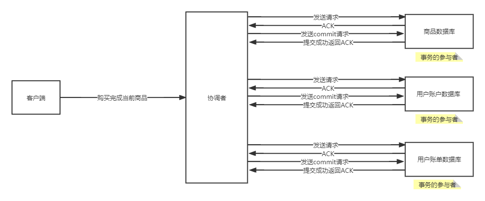
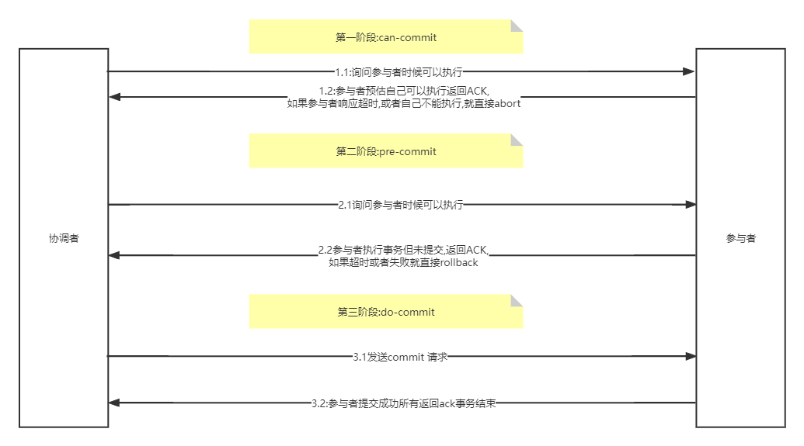

# 一、前置

## 一、怎么理解分布式事务？

### 一、本地事务

> 事务主要为了保证数据操作的原子性,以及数据的一致性。满足ACID四大特性即可。
>
> 本地事务可以依赖本地数据库提供的事务特性来进行事务操作。

### 二、为什么要用分布式事务?

> 在分布式这种环境中服务之间不在同一个 jvm中,要保证数据的原子性与一致性,本地数据库提供的事务特性就不起作用了,怎么办?分布式事务这不就来了吗?

## 二、BASE 理论

### 一、基本可用

> 响应延迟:在分布式的环境下,如果有一台服务宕了,不会影响到整个服务,这时候宕掉的机器很快被从机代替(前提是搭建了集群),用户访问可能会有延迟。
>
> 功能上的缺失:当用户访问的一个服务突然连接超时或者宕机了,这时候会触发降级策略,返回用户友好的界面

### 二、弱状态

> 用户可以查询到数据的中间状态
>
> 理解:当用户买东西支付的时候,钱刚支付的时候金额并没有打到商家的账户上,这时候用户可以看到正在支付中,支付中就是数据的中间状态。

### 三、最终一致性

> 在集群的环境下,数据同步的时候可以有延迟,虽然不能保证每个节点同一时间点到的数据都是一样的,但能保证数据最后能同步到所有的节点。

## 三、一致性

###  一、强一致性

> 在集群的环境下,当需要进行数据同步的时候,整个集群对外不在提供访问,直接丢失高可用,直到所有的节点同步完成之后才会对外提供访问。说白了就是要保证所有节点的数据必须一样。

### 二、弱一致性

> 在集群的环境下,当需要进行数据同步的时候,每个节点中的数据可能不是最新的,数据过一会可能会同步到这个数据,但不能保证每个节点都能得到这个数据,所以说弱一致性可能丢数据。

### 三、最终一致性

> 最终一致性和弱一致性差不多,但是能保证数据最后同步到所有的节点中。

# 二、分布式事务协议

## 一、2PC(两阶段提交协议)

### 一、阶段

> 1. 准备阶段
> 2. 提交阶段

### 二、角色

> 1. 协调者:事务的发起者。
> 2. 参与者:事务的执行者。

### 三、2PC工作流程

#### 一、画图展示



#### 二、第一阶段(确认阶段)

##### 一、全部成功状态

> 1. 协调者会向所有的参与者发送消息,来确认所有的协调者是否准备好了。
> 2. 协调者这时候会记录自己的unlog与redolog(如果这两个日志不清楚的话可以去复习MySQL),所有的协调者会开启事务,去执行sql语句,但是没有commit。
> 3. 当所有的协调者返回ack的时候协调者就会准备第二阶段。

##### 二、参与者失败状态

> 1. 如果其中有一个参与者返回失败,这时候协调者发送rollback请求,所有的协调者就会回滚到执行之前的状态
> 2. 如果有参与者响应超时达到了协调者等待的阈值,协调者也会发送rollback请求。

#### 三、第二阶段(事务提交阶段)

> 1. 前面的步骤都没啥问题协调者就会发送commit请求给所有的参与者。
> 2. 参与者这时候就会真正的去提交事务。将结果返回给协调者。

####  四、不足

> 1. 执行效率底下:协调者必须等待所有的参与者给出反馈才能执行下一个阶段。所以**很**不适合高并发场景下。
> 2. 不能保证事务的一致性:当协调者发送commit请求的时候,突然某个服务的mysql宕了(某个参与者宕了),就不能保证当前的协调这进行了commit。

## 二、3pc(三阶段提交协议)

> 比二阶段提交多了准备阶段,首先会试探参与者的状态,大大的避免的回滚的操作。效率也有一定的提升。

### 一、画图展示

### 二、第一阶段(can-commit)

#### 一、全部成功状态

> 1. 协调者向参与者发送消息,参与者就会预估自己是否可以执行,如果可以执行返回ACK给协调者并进入预备状态,协调者就会准备第二阶段。

#### 二、失败状态

> 1. 如果某一个参与者响应超时,或者自己不能执行,协调者直接中止本次执行。

### 三、第二阶段(pre-commit)

#### 一、全部成功状态

> 1. 协调者就会向所有的参与者发送消息,参与者接受到消息之后这时候就会记录自己的undolog,redolog,开启事务并执行sql。这时候事务还未提交。
> 2. 当参与者执行完sql之后,就会返回ACK给协调者。
> 3. 当协调者接受到所有的参与者发送的ACK,进入第三阶段。

#### 二、失败状态

> 1. 如果其中一个参与者执行失败,协调者就会发送rollback请求,所有的协调者就会回滚到执行事务之前的状态。
> 2. 如果其中一个参与者响应超时,协调者就会发送rollback请求,所有的协调者就会回滚到执行事务之前的状态。

### 四、第三阶段(do-commit)

#### 一、全部成功状态

> 1. 协调者就会向所有的参与者发送请求,参与者接受到消息之后,就会将自己的事务进行提交。
> 2. 所有的参与者返回ACK分布式事务执行完成。

### 五、不足

> 不能保证事务的一致性:当协调者发送commit请求的时候,突然某个服务的mysql宕了(某个参与者宕了),就不能保证当前的协调这进行了commit。

## 三、TCC(事务补偿机制)

## 一、概念

#### 一、第一阶段

> 1. try:主要对业务进行判断检查数据的合法性,这时候会将资源锁定。如果数据合法也满足所有的需求,就进入confrim,否则的话就进入cancel

#### 二、第二阶段

> 1. confrim:当try校验成功过后就交给confrim去执行事务。如果confrim中出错了,这时候就要人工干预。否则就会一直进行重试。 
> 2. cancel:当try校验失败过后就交给cancel。执行取消操作(释放锁)。否则就会一直进行重试。 

## 二、优缺点

#### 一、优点

> 能保证数据的最终一致性。

#### 二、缺点

> 1. 如果confrim跟cancel执行失败,就会一直不停的重试,很损耗性能。
> 2. 并发性能一般。
> 3. 业务耦合度变高,提高了开发成本。

## 四、XA协议

> 没人用,XA分布式事务协议，包含二阶段提交（2PC），三阶段提交（3PC）两种实现。

# 三、分布式事务解决方案(Seata)

## 一、前置

####  一、官方话术

> 1. RM (Resource Manager) - 资源管理器:管理分支事务处理的资源，与TC交谈以注册分支事务和报告分支事务的状态，并驱动分支事务提交或回滚。
> 2.  TM (Transaction Manager) - 事务管理器:定义全局事务的范围：开始全局事务、提交或回滚全局事务。
> 3.  TC (Transaction Coordinator) - 事务协调者:维护全局和分支事务的状态，驱动全局事务提交或回滚。

#### 二、说人话

> 1. TC:负责下达指令给RM
> 2. RM:就是当成每个服务中被远程调用的方法。
> 3. TM:向RM下达指令,向TC注册全局事务,决定全局事务的回滚还是提交。

## 二、 AT模式

> AT模式类似与二阶段提交协议,由seata进行改进。

### 一、执行流程

> 查看我画的PDF文档。

### 二、Undolog日志表

#### 一、作用

> undolog表起到事物回滚的操作,当事物需要回滚的时候,就利用undolog日志表进行回滚。

#### 二、创建表

> 每一个参与者**必须!**有这个日志表!!!

```sql
-- 注意此处0.7.0+ 增加字段 context
CREATE TABLE `undo_log` (
  `id` bigint(20) NOT NULL AUTO_INCREMENT,
  `branch_id` bigint(20) NOT NULL,
  `xid` varchar(100) NOT NULL,
  `context` varchar(128) NOT NULL,
  `rollback_info` longblob NOT NULL,
  `log_status` int(11) NOT NULL,
  `log_created` datetime NOT NULL,
  `log_modified` datetime NOT NULL,
  PRIMARY KEY (`id`),
  UNIQUE KEY `ux_undo_log` (`xid`,`branch_id`)
) ENGINE=InnoDB AUTO_INCREMENT=1 DEFAULT CHARSET=utf8;
```

## 三、搭建TC

### 一、下载Seata

> [seata下载地址][https://github.com/seata/seata/releases/download/v1.5.2/seata-server-1.5.2.tar.gz]

### 二、详细的部署搭建官网

> [官网搭建][https://seata.io/zh-cn/docs/ops/deploy-guide-beginner.html]

### 三、seata上传配置(Nacos)

#### 一、脚本地址

[seata/seata: Seata is an easy-to-use, high-performance, open source distributed transaction solution. (github.com)](https://github.com/seata/seata)

#### 二、修改配置

```bash
#For details about configuration items, see https://seata.io/zh-cn/docs/user/configurations.html
#Transport configuration, for client and server
transport.type=TCP
transport.server=NIO
transport.heartbeat=true
transport.enableTmClientBatchSendRequest=false
transport.enableRmClientBatchSendRequest=true
transport.enableTcServerBatchSendResponse=false
transport.rpcRmRequestTimeout=30000
transport.rpcTmRequestTimeout=30000
transport.rpcTcRequestTimeout=30000
transport.threadFactory.bossThreadPrefix=NettyBoss
transport.threadFactory.workerThreadPrefix=NettyServerNIOWorker
transport.threadFactory.serverExecutorThreadPrefix=NettyServerBizHandler
transport.threadFactory.shareBossWorker=false
transport.threadFactory.clientSelectorThreadPrefix=NettyClientSelector
transport.threadFactory.clientSelectorThreadSize=1
transport.threadFactory.clientWorkerThreadPrefix=NettyClientWorkerThread
transport.threadFactory.bossThreadSize=1
transport.threadFactory.workerThreadSize=default
transport.shutdown.wait=3
transport.serialization=seata
transport.compressor=none

#Transaction routing rules configuration, only for the client
service.vgroupMapping.default_tx_group=default  #配置Seata分组(Java整合需要用)
#If you use a registry, you can ignore it
service.default.grouplist=127.0.0.1:8091  #ip一定是能外网访问得到的!!!
service.enableDegrade=false
service.disableGlobalTransaction=false

#Transaction rule configuration, only for the client
client.rm.asyncCommitBufferLimit=10000
client.rm.lock.retryInterval=10
client.rm.lock.retryTimes=30
client.rm.lock.retryPolicyBranchRollbackOnConflict=true
client.rm.reportRetryCount=5
client.rm.tableMetaCheckEnable=true
client.rm.tableMetaCheckerInterval=60000
client.rm.sqlParserType=druid
client.rm.reportSuccessEnable=false
client.rm.sagaBranchRegisterEnable=false
client.rm.sagaJsonParser=fastjson
client.rm.tccActionInterceptorOrder=-2147482648
client.tm.commitRetryCount=5
client.tm.rollbackRetryCount=5
client.tm.defaultGlobalTransactionTimeout=60000
client.tm.degradeCheck=false
client.tm.degradeCheckAllowTimes=10
client.tm.degradeCheckPeriod=2000
client.tm.interceptorOrder=-2147482648
client.undo.dataValidation=true
client.undo.logSerialization=jackson
client.undo.onlyCareUpdateColumns=true
server.undo.logSaveDays=7
server.undo.logDeletePeriod=86400000
client.undo.logTable=undo_log
client.undo.compress.enable=true
client.undo.compress.type=zip
client.undo.compress.threshold=64k
#For TCC transaction mode
tcc.fence.logTableName=tcc_fence_log
tcc.fence.cleanPeriod=1h

#Log rule configuration, for client and server
log.exceptionRate=100

#Transaction storage configuration, only for the server. The file, DB, and redis configuration values are optional.
store.mode=db    #设置数据库保存数据 
store.lock.mode=file
store.session.mode=file
#Used for password encryption
store.publicKey=

#If `store.mode,store.lock.mode,store.session.mode` are not equal to `file`, you can remove the configuration block.
store.file.dir=file_store/data
store.file.maxBranchSessionSize=16384
store.file.maxGlobalSessionSize=512
store.file.fileWriteBufferCacheSize=16384
store.file.flushDiskMode=async
store.file.sessionReloadReadSize=100

#These configurations are required if the `store mode` is `db`. If `store.mode,store.lock.mode,store.session.mode` are not equal to `db`, you can remove the configuration block.
store.db.datasource=druid
store.db.dbType=mysql
store.db.driverClassName=com.mysql.jdbc.Driver
store.db.url=jdbc:mysql://127.0.0.1:3306/seata?useUnicode=true&rewriteBatchedStatements=true
store.db.user=username  #设置同户名
store.db.password=password  #设置密码
store.db.minConn=5
store.db.maxConn=30
store.db.globalTable=global_table
store.db.branchTable=branch_table
store.db.distributedLockTable=distributed_lock
store.db.queryLimit=100
store.db.lockTable=lock_table
store.db.maxWait=5000

#These configurations are required if the `store mode` is `redis`. If `store.mode,store.lock.mode,store.session.mode` are not equal to `redis`, you can remove the configuration block.
store.redis.mode=single
store.redis.single.host=127.0.0.1
store.redis.single.port=6379
store.redis.sentinel.masterName=
store.redis.sentinel.sentinelHosts=
store.redis.maxConn=10
store.redis.minConn=1
store.redis.maxTotal=100
store.redis.database=0
store.redis.password=
store.redis.queryLimit=100

#Transaction rule configuration, only for the server
server.recovery.committingRetryPeriod=1000
server.recovery.asynCommittingRetryPeriod=1000
server.recovery.rollbackingRetryPeriod=1000
server.recovery.timeoutRetryPeriod=1000
server.maxCommitRetryTimeout=-1
server.maxRollbackRetryTimeout=-1
server.rollbackRetryTimeoutUnlockEnable=false
server.distributedLockExpireTime=10000
server.xaerNotaRetryTimeout=60000
server.session.branchAsyncQueueSize=5000
server.session.enableBranchAsyncRemove=false
server.enableParallelRequestHandle=false

#Metrics configuration, only for the server
metrics.enabled=false
metrics.registryType=compact
metrics.exporterList=prometheus
metrics.exporterPrometheusPort=9898

```

#### 三、执行脚本

##### 一、在config文件目录下创建script文件夹

##### 二、在script文件夹中放入nacos脚本

##### 三、进入script目录执行脚本(git)

> sh nacos-config.sh -h  [nacos地址]  -p [nacos的端口号] -g [seata服务分组] -t [seata服务命名空间] -u [nacos用户名] -w [nacos密码]

## 四、Java整合Seata

### 一、依赖

```xml
<!-- https://mvnrepository.com/artifact/io.seata/seata-spring-boot-starter -->
<dependency>
    <groupId>io.seata</groupId>
    <artifactId>seata-spring-boot-starter</artifactId>
    <version>1.5.2</version>
</dependency>
```

### 一、配置文件(RM)

```yml
spring:
  application:
    name: qianqiwei-commodity
  cloud:
    nacos:
      discovery:
        server-addr: 6.0.2.52:8848
        username: nacos
        password: nacos
        namespace: b5dad5e5-de71-4307-b86e-9e2875a498a7 #一定要跟seata服务同一个命名空间!!!
        group: SEATA_GROUP  #一定要跟seata服务同一组!!!
  datasource:
    username: root
    password: Qianqiwei2003817
    url: jdbc:mysql://6.0.2.52:4306/db_commodity?serverTimezone=UTC
    driver-class-name: com.mysql.cj.jdbc.Driver


seata:
  enabled: true  #开启seata(默认)
  application-id: ${spring.application.name}
  tx-service-group: default_tx_group #seata分组(上传配置文件一定要有)
  config:
    nacos:
      namespace: b5dad5e5-de71-4307-b86e-9e2875a498a7  #seata服务注册的命名空间
      server-addr: 6.0.2.52:8848
      group: SEATA_GROUP  #seata服务注册的分组
      username: nacos
      password: nacos
    type: nacos  #一定要加这个!才能识别到是nacos
  registry:
    nacos:
      application: seata-server #默认seata-server
      server-addr: 6.0.2.52:8848
      namespace: b5dad5e5-de71-4307-b86e-9e2875a498a7 #seata服务注册的命名空间
      group: SEATA_GROUP  #seata服务注册的分组
      username: nacos
      password: nacos
    type: nacos #一定要加这个!才能识别到是nacos


server:
  port: 8080

```
